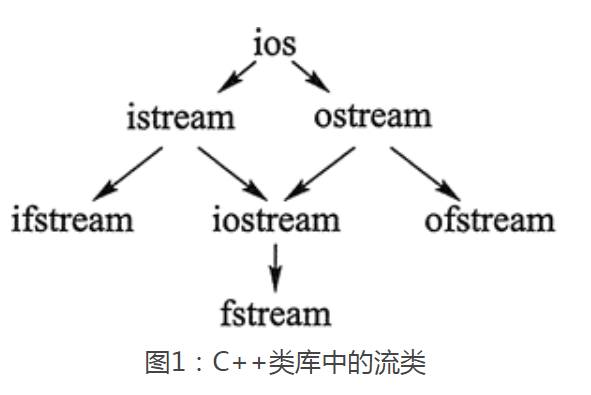
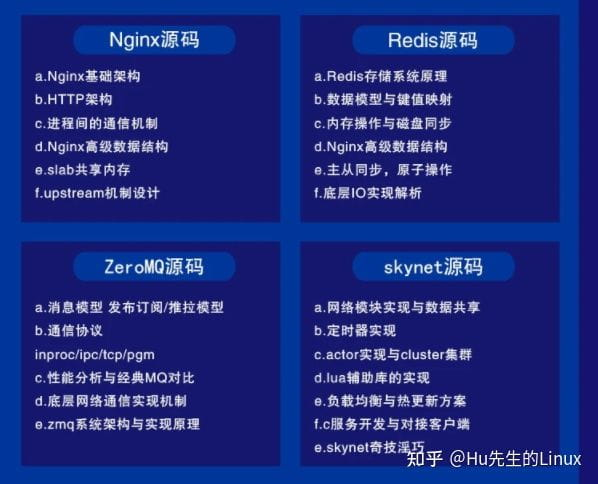
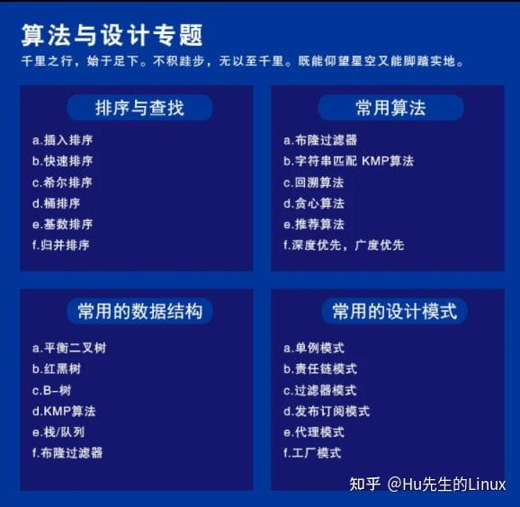
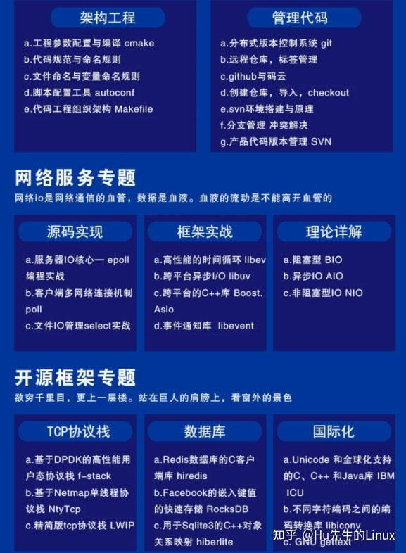
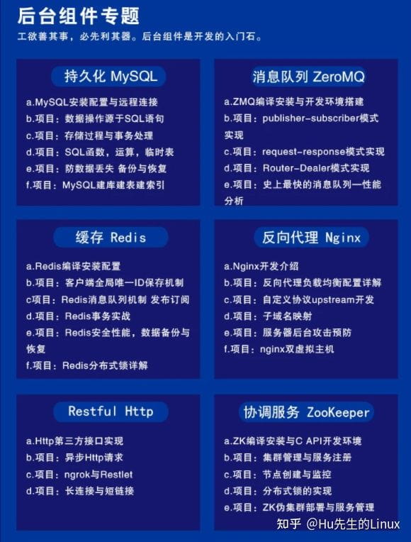
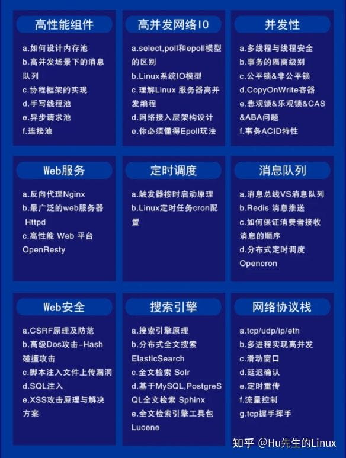

[c++11-20所有新特性](https://www.bilibili.com/video/BV13T4y1k7qQ?t=10.7)


## 参考材料

>	https://isocpp.org/
>	[标准版本参考]
>	https://en.cppreference.com/w/cpp/compiler_support
>	[儿童版本参考]
>	https://cplusplus.com/


## C++标准（ISO/C++) 

>   c++标准只是一种规范，是对要实现功能的定义，规范只是规定了需要实现哪些内容，而具体如何实现就不属于规范范畴了。它包括
>
>   - **c++语言标准（实现：编译器gcc，msvc）**
>
>   - **c++标准库标准（实现：libc++，libstdc++）**


```
   c++标准库（std）的内容可以分为10类：
   
   1. 语言支持:<limits>,<climits>,<cfloat>,<cstdint>,<new>,<ctime>,<cstdlib>,<csignal>,
   2. IO操作:<iostream>,<ios>,<iosfwd>,<streambuf>,<istream>,<ostream>,<iomanip>,<sstream>,
   3. 诊断:<exception>,<stdexcept>,<cassert>,<cerrno>,<system_error>
   4. 通用工具：<utility>,<tuple>,<functional>,<memory>,<chrono>,<ctime>,<iterator>
   5. 字符串：<string>,<cctype>,<cwctype>,<regex>,<cwchar>,<cstdlib>,<cuchar>,<cstring>
   6. 容器：<deque>,<vector>,<list>,<map>,<queue>,<set>,<stack>,<array>,<bitset>,<forward_list>,<unordered_map>,<unordered_set>
   7. 并发：<atomic>,<thread>,<mutex>,<future>,<condition_variable>
   8. 算法：<algorithm>,<cstdlib>
   9. 数值操作：<numeric>,<complex>,<cmath>,<random>,<cstdlib>,<valarray>
   10. 本地化:<locale>,<clocale>,<condecvt>
```

   

**如果一个程序的功能完全使用标准库中的东西来实现的话，就可以做到跨平台（一份相同的代码，在不同操作系统上编译执行）。因为标准库中的东西其实只是接口（对功能的定义），具体到不同平台的c++标准库实现是不同的（gun/linux中是libstdc++，mac和ios中是libc++，android中是NDK），具体实现其实是对系统调用的使用来实现的。**


### stl
    stl由:容器,迭代器,算法,函数对象组成

#### 容器

>   [emplace_back()和push_back()区别和注意](https://www.cnblogs.com/zuofaqi/p/10194541.html)

```c++
队列：queue

//初始化
queue<T> que;//默认构造
queue(const queue &q);//拷贝构造

//操作
push(e);//add to tail
pop();//remove head
back();//get tail
front();//get head
size();//get size
empty();//if noting


```


#### 迭代器

```

```


#### 算法

```

```


#### 函数对象

```c++
class func
{
    void operator ()(int aa);
}
func a;//函数对象
a(3);


double fs(int a);
functional<double(int))> fo = bind(f,3);//fo为函数对象
```


---

## C++语法相关

​	

### 重要知识点

#### 对象初始化方式

- 显示调用：

  - stock s= stock();
  - stock* sp= new stock("hi",123);

- 隐式调用：

  - stock s;				-->调用默认构造函数

  - stock s("hello",123);	-->没有参数的时候不能写成这样stock s().该句是声明一个函数。要用上面的形式。

#### 对象是什麽

​	每一个新对象其实就是一块c-结构体空间。

​	stock s；的意思是在变量声明堆栈上开辟一块stock大小的内存空间，s是该区域的地址（相当于汇编中的标号）。

​	但调用构造函数之后就相当于对这块内存的对应区域进行了初始化。而不同对象是共用类的方法的，成员函数通过缺省的this指针知道该调用哪一个对象的数据来改变。

#### 构造函数：

​		默认构造函数:stock();								  -->stock a;
​		复制构造函数:stock(const stock&s);	 	-->stock a = stock(b);			使用一个对象来创建另一个对象
​																					stock a(b);
​																					stock* a= new stock(b);
​																					stock a=b;
​		移动构造函数:stock(const stock&&s);		-->
​		赋值操作符： stock& operator=(const stock &s);  --> a=b				将a对象重新赋值为b。

**必须使用成员初始化列表初始化的三种情况**

- const成员变量的初始化
- 引用成员的初始化
- 初始化没有默认构造函数的对象（该对象可能是继承来的，也可以是组合的对象）

#### 继承：

- 派生类和基类之间的关系：
  ​		1.派生类对象可以使用基类中的公有方法（派生类--》基类）
  ​		2.基类指针或引用可以指向派生类对象（基类--》派生类），但是该指针或引用只能访问派生类中基类的方法

- 3种继承方式（私有，保护，公有）改变的只是继承体系之外的使用派生类的访问权限，而对于继承体系之内（基类，派生类）基类中成员是什麽访问权限，对于派生类来说就是什么权限。


#### 各种操作符优先级


RAII

1. lock_guard\<mutex\>
2. unique_lock\<mutex\> 		支持条件变量


### 流

> [c语言中文网](http://c.biancheng.net/view/272.html) 
>
> 

```c++
getline(src,dst);
gets(src);//可以无限读取，以回车结束读取
cin.get(box,box_size);//函数可以接收空格，遇回车结束输入。
cin.getline(box,box_size);//函数可以同cin.get()函数类似，也可接收空格，遇回车结束输入
```





- istream 是用于输入的流类，cin 就是该类的对象。
- ostream 是用于输出的流类，cout 就是该类的对象。
- ifstream 是用于从文件读取数据的类。
- ofstream 是用于向文件写入数据的类。
- iostream 是既能用于输入，又能用于输出的类。
- fstream 是既能从文件读取数据，又能向文件写入数据的类。


## 后台开发学习指南

[C++后台开发，以我之见](https://zhuanlan.zhihu.com/p/352365043)















