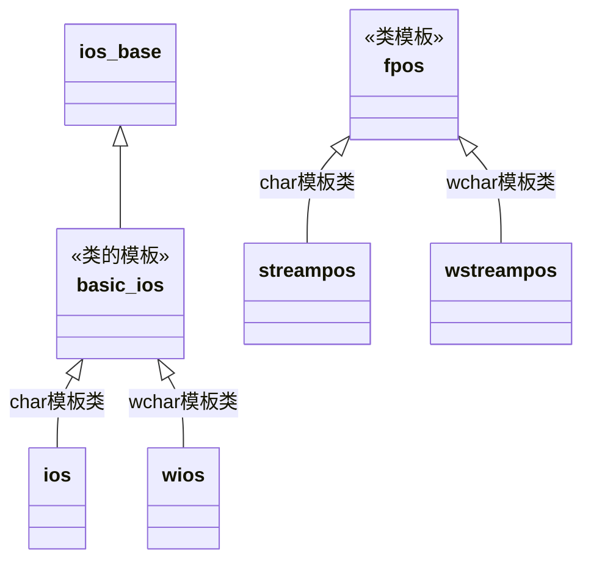
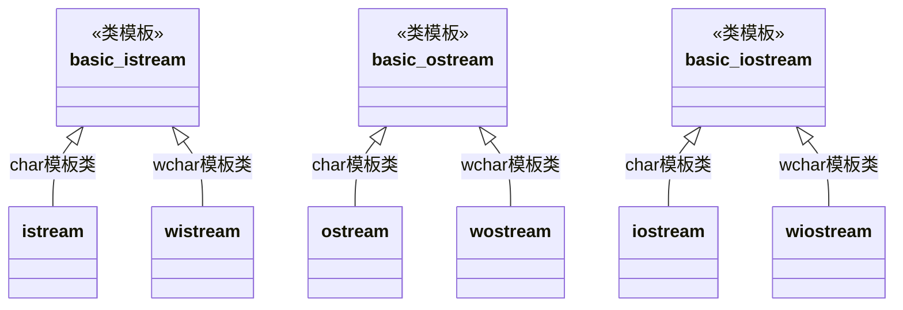

### stream类型

stream有如下几种类型

1. 标准输入输出流
2. string流
3. file流

### stream类继承体系

### ios

- ios_base 和 basic_ios 定义了不区分是输入流还是输出流的基本功能
- ios_base 独立于模板参数（不是模板类），描述了所有类型的stream的最基本部分，独立于stream的具体数据类型
- basic_ios 依赖于模板参数，是一个类模板，通过传入不同的模板参数创建不同模板类
- fpos 代表在stream中的位置

### istream-ostream

- basic_istream继承自basic_ios。因此具有basic_ios的功能

