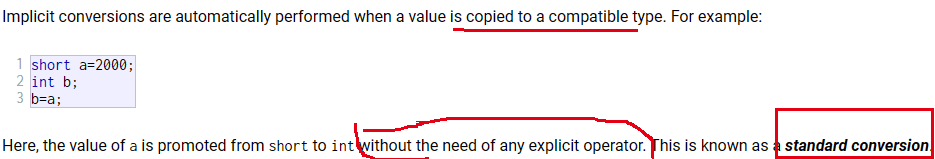
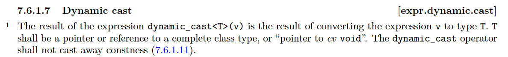
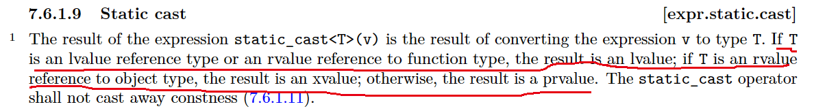

### 参考文档

> https://cplusplus.com/doc/tutorial/typecasting/
> [表达式 - cppreference.com](https://zh.cppreference.com/w/cpp/language/expressions)

### 标准转换-隐式转换

| 特殊运算符       | 作用                             |
| ---------------- | -------------------------------- |
| static_cast      | 相关类型之间的转换 |
| dynamic_cast     | 在有继承关系的类型之间转换类型   |
| const_cast       | 添加或移除const或volatile        |
| reinterpret_cast | 不相关的类型之间的转换                                 |

### dynamic_cast

表达式 `dynamic_cast<T>(v)` 的结果是将表达式 `v` 转换为类型 `T` 。类型T应该是一个指向完整class type的指针或引用，或者是指向 `cv void` 的指针

解释：
`cv void` ：其中的cv指代的是两个关键字const 和 volatile 。cv void指的就是被这两个关键字组合出的各种void类型的统称。如: `const void`, `volatile void`, `const volatile void`

| value   | mean |
| ------- | ---- |
| prvalue |      |
| glvaule |      |
| xvalue  |      |

### static_cast

类型转换表达式 `static_cast<T>(v)` 用于将表达式v转为类型T。
- 如果T是一个左值引用或一个函数的右值引用，那么转换结果为左值。
- 如果T是一个对象的右值引用，结果是xvalue
- 否则转换结果为prvalue

### reinterpret_cast

### const_cast

### 显式转换

使用c风格或函数风格的转换

### 用户自定义转换