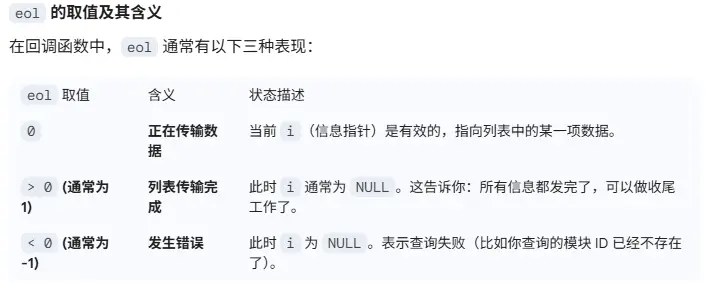

[PulseAudio - ArchWiki](https://wiki.archlinux.org/title/PulseAudio#default.pa)

[PulseAudio under the hood](https://gavv.net/articles/pulseaudio-under-the-hood/)


```shell
 ~/.config/pulse/default.pa
 # 加载网络模块
.include /etc/pulse/default.pa
load-module module-native-protocol-tcp auth-anonymous=1


# 客户端网络访问
env PULSE_SERVER=172.16.14.248 ./pavucontrol-qt
```


**切换到Line-In**

1. 将Line-In设备作为默认sources
2. 加载回环模块 `module-loopback` 

```shell
[load]
pactl load-module module-loopback source=<source_name> sink=<sink_name>

[额外参数]
- `latency_msec=<value>`: 设置延迟（毫秒）。
- `sink_input_properties=<properties>`: 定义额外的属性，比如音频流名称

[info]
pactl list modules short

[unload]
pactl unload-module <module_id>

eg:
pactl load-module module-loopback source=alsa_input.pci-0000_00_1f.3.analog-stereo sink=alsa_output.pci-0000_00_1f.3.analog-stereo
```


3. 对其他音频流(sink-sources)各种类型[event,video,audio]静音mute,或只保留指定的类型。 `media.role` 既有内置类型，也可以自定义

> sink-input-by-media-role:event
> event: 系统音效
> video: 视频类型
> audio：音频类型
> phone: 手机
> game：游戏


**切换到系统音源**

1. 卸载回环模块
2. 取消静音


**创建虚拟sink设备，并重定向到实际的sink设备**

```
1. 创建虚拟sink

pactl load-module module-null-sink sink_name=alsa_output.platform-LineOut.stereo-fallback sink_properties=device.description="线路输出"

2. 重定向音频流

pactl load-module module-loopback source=LineOut.monitor sink=alsa_output.pci-0000_00_1b.0.analog-stereo


======逆过程=====

1. 取消重定向
2. 删除虚拟sink
```


**修改设备描述**

参考：[pulse-cli-syntax(5) — Arch manual pages](https://man.archlinux.org/man/pulse-cli-syntax.5#NAME)


```bash
修改/etc/pulse/default.pa，添加如下命令，最后重启音频服务

update-sink-proplist alsa_output.platform-hdmi0-sound.stereo-fallback device.description="我的hdmi声卡"

systemctl --user restart pulseaudio.service
```


## Ladspa

LADSPA 是一个标准，它允许软件音频处理器和效果器被 “插件化” 到各种音频合成与录音软件中。
例如，开发者可以编写一个混响程序，并将其打包为 LADSPA “插件库”。普通用户随后就能在任何支持 LADSPA 的音频应用里使用这个混响效果。Linux 上的大多数主流音频应用都支持 LADSPA。
简单来说，LADSPA 和 LV2 是 Linux 系统上的“音频效果器插件标准”。你可以把它们想象成 Photoshop 的滤镜，或者是游戏里的 MOD，只不过它们处理的是声音。

### 插件开发流程

编写一个 LADSPA (Linux Audio Developer's Simple Plugin API) 插件本质上是编写一个符合特定 C 语言接口规范的 **动态链接库 (.so)**。

LADSPA 的设计极其简洁，它不处理 UI，只关注音频数据的输入、输出和控制。以下是编写插件的核心步骤和代码结构。

---

#### 1. 核心结构：`LADSPA_Descriptor`

每一个插件都必须提供一个 `LADSPA_Descriptor` 结构体，它定义了：

* **唯一 ID**：全局唯一的数字标识。
* **端口（Ports）**：插件的“引脚”，包括音频输入/输出和控制输入/输出（如音量、频率参数）。
* **回调函数**：
* `instantiate`：创建插件实例。
* `connect_port`：将内存缓冲区绑定到端口。
* `run`：**核心计算逻辑**，音频处理就在这里发生。
* `cleanup`：释放内存。


---

#### 2. 最小插件代码示例 (`amp.c`)

这是一个简单的“放大器”插件，它接收音频输入并根据控制参数进行增益。

```c
#include <stdlib.h>
#include <ladspa.h>

/* 定义端口索引 */
#define AMP_GAIN    0
#define AMP_INPUT   1
#define AMP_OUTPUT  2

typedef struct {
    unsigned long sample_rate;
    LADSPA_Data * gain;
    LADSPA_Data * input;
    LADSPA_Data * output;
} Amplifier;

/* 实例化函数 */
LADSPA_Handle instantiateAmp(const LADSPA_Descriptor * Descriptor, unsigned long SampleRate) {
    Amplifier * ptr = (Amplifier *)malloc(sizeof(Amplifier));
    ptr->sample_rate = SampleRate;
    return (LADSPA_Handle)ptr;
}

/* 绑定端口 */
void connectPortAmp(LADSPA_Handle Instance, unsigned long Port, LADSPA_Data * DataLocation) {
    Amplifier * ptr = (Amplifier *)Instance;
    switch (Port) {
        case AMP_GAIN:   ptr->gain = DataLocation; break;
        case AMP_INPUT:  ptr->input = DataLocation; break;
        case AMP_OUTPUT: ptr->output = DataLocation; break;
    }
}

/* 核心处理逻辑 */
void runAmp(LADSPA_Handle Instance, unsigned long SampleCount) {
    Amplifier * ptr = (Amplifier *)Instance;
    LADSPA_Data gain = *(ptr->gain);
    for (unsigned long i = 0; i < SampleCount; i++) {
        ptr->output[i] = ptr->input[i] * gain;
    }
}

void cleanupAmp(LADSPA_Handle Instance) {
    free(Instance);
}

/* 插件描述符定义 */
static LADSPA_Descriptor * g_descriptor = NULL;

const LADSPA_Descriptor * ladspa_descriptor(unsigned long Index) {
    if (Index != 0) return NULL;
    if (!g_descriptor) {
        g_descriptor = (LADSPA_Descriptor *)malloc(sizeof(LADSPA_Descriptor));
        g_descriptor->UniqueID = 1234; // 替换为你的唯一ID
        g_descriptor->Label = "simple_amp";
        g_descriptor->Name = "Simple Amplifier";
        g_descriptor->Maker = "Your Name";
        g_descriptor->PortCount = 3;
        
        LADSPA_PortDescriptor * pdes = (LADSPA_PortDescriptor *)malloc(sizeof(LADSPA_PortDescriptor) * 3);
        g_descriptor->PortDescriptors = (const LADSPA_PortDescriptor *)pdes;
        pdes[AMP_GAIN] = LADSPA_PORT_INPUT | LADSPA_PORT_CONTROL;
        pdes[AMP_INPUT] = LADSPA_PORT_INPUT | LADSPA_PORT_AUDIO;
        pdes[AMP_OUTPUT] = LADSPA_PORT_OUTPUT | LADSPA_PORT_AUDIO;

        // ... 此处省略部分端口名称和范围限制的初始化代码 ...
        g_descriptor->instantiate = instantiateAmp;
        g_descriptor->connect_port = connectPortAmp;
        g_descriptor->run = runAmp;
        g_descriptor->cleanup = cleanupAmp;
    }
    return g_descriptor;
}

```

---

#### 3. 编译与安装

1. **编译为动态库**：
LADSPA 插件必须使用 `-fPIC` 和 `-shared` 标志编译。
```bash
gcc -I. -fPIC -shared -o my_amp.so amp.c

```


2. **安装位置**：
将生成的 `.so` 文件移动到系统 LADSPA 路径下（通常是 `/usr/lib/ladspa/` 或 `/usr/local/lib/ladspa/`）。或者设置环境变量：
```bash
export LADSPA_PATH=$LADSPA_PATH:/home/user/my_plugins

```


3. **验证插件**：
使用 `listplugins` 或 `analyseplugin` 工具查看是否识别成功：
```bash
analyseplugin ./my_amp.so

```


---

#### 4. 针对 RK3588 的优化建议

在 RK3588 上编写插件时，由于它是基于 ARM 架构，你可以利用硬件特性提升性能：

* **NEON 加速**：在 `run` 函数中，使用 ARM NEON 指令集进行 SIMD（单指令多数据）计算。例如，在处理均衡器（EQ）的大量浮点运算时，一次处理 4 个采样点可以显著降低 CPU 占用。
```c
#include <arm_neon.h>
// 使用 float32x4_t 等类型进行并行计算

```


* **避免系统调用**：`run` 函数是在音频线程中实时调用的，**严禁**在其中使用 `printf`、`malloc` 或任何可能引起阻塞的操作，否则会导致音频断断续续。
* **硬浮点运算**：确保编译时开启了硬浮点支持（`-mfloat-abi=hard -mfpu=neon-vfpv4`）。

#### 5. 进阶工具：FAUST

如果你觉得手写 C 语言处理复杂的数学公式（如 IIR 滤波器）太麻烦，推荐学习 **FAUST** 语言。

* 它是一种专为音频设计的函数式编程语言。
* 它可以**自动生成**完美的 LADSPA C++ 源代码。
* 对于 RK3588，FAUST 生成的代码通常已经过高度的数学逻辑优化。

你想尝试用 C 语言手写一个简单的均衡器算法（类似 `mbeq` 的一级实现），还是想了解如何使用 NEON 优化现有的代码？

## 音效切换

音效切换脚本： `apt install swh-plugins tap-plugins ladspa-sdk` 

```bash
#!/bin/bash

# --- 配置区 ---
# 获取默认 Sink 的名称（通常是你的声卡）
MASTER_SINK=$(pactl info | grep "Default Sink" | cut -d' ' -f3)
MODULE_NAME="module-ladspa-sink"
SINK_ALIAS="Enhanced_Audio"

# --- 函数：清理旧模块 ---
unload_effect() {
    # 查找并卸载之前加载过的 ladspa 模块
    module_ids=$(pactl list modules short | grep "$MODULE_NAME" | cut -f1)
    for id in $module_ids; do
        pactl unload-module "$id"
    done
    echo "已清理旧音效"
}

# --- 函数：加载新模块 ---
# 参数说明：plugin_file, label, control_params
load_effect() {
    unload_effect
    echo "正在加载模式: $1..."
    
    pactl load-module $MODULE_NAME \
        sink_name=$SINK_ALIAS \
        master=$MASTER_SINK \
        plugin=$2 \
        label=$3 \
        control=$4
    
    # 将默认输出切换到音效 Sink
    pactl set-default-sink $SINK_ALIAS
}

# --- 模式定义 ---
case $1 in
    "music")
        # 使用 10 段均衡器 (tap_equalizer)，V型调音
        # 参数依次为各个频段的增益 (dB)
        load_effect "音乐" "tap_equalizer" "tap_equalizer" "6,3,0,0,0,0,0,2,4,6"
        ;;
    "vocal")
        # 使用三段参数均衡器 (triple_para_equalizer_1204)
        # 低切 + 中频提升
        load_effect "人声" "triple_para_equalizer_1204" "tripleParaEq" "0,10,2000,5,0"
        ;;
    "movie")
        # 使用混响 (freeverb_1219) 增加空间感
        # 参数：RoomSize, Damping, Wet, Dry, Width
        load_effect "影院" "freeverb_1219" "freeverb" "0.2,0.5,0.3,0.9,0.5"
        ;;
    "meeting")
        # 使用压缩器 (sc1_1425) 稳定音量
        # 参数：Attack, Release, Threshold, Ratio, Knee
        load_effect "会议" "sc1_1425" "sc1" "10,100,-20,4,1"
        ;;
    "none"|*)
        unload_effect
        echo "已恢复标准模式 (已卸载插件)"
        ;;
esac
```


---

### 开发调试工具

`ladspa-sdk` 中有几个工具可以用于 `ladspa` 插件调试和信息查看

`listplugins` ：用于列举出安装的所有 `ladspa` 的插件
`analyseplugin` : 用于解析某一个插件的详细元数据信息，以及参数列表
`applyplugin` ：用于将输入音频文件通过插件处理生成输出音频文件

```bash
$ analyseplugin /usr/lib/ladspa/mbeq_1197.so

Plugin Name: "Multiband EQ"
Plugin Label: "mbeq"
Plugin Unique ID: 1197
Maker: "Steve Harris <steve@plugin.org.uk>"
Copyright: "GPL"
Must Run Real-Time: No
Has activate() Function: Yes
Has deactivate() Function: No
Has run_adding() Function: Yes
Environment: Normal or Hard Real-Time
Ports:  "50Hz gain (low shelving)" input, control, -70 to 30, default 0
        "100Hz gain" input, control, -70 to 30, default 0
        "156Hz gain" input, control, -70 to 30, default 0
        "220Hz gain" input, control, -70 to 30, default 0
        "311Hz gain" input, control, -70 to 30, default 0
        "440Hz gain" input, control, -70 to 30, default 0
        "622Hz gain" input, control, -70 to 30, default 0
        "880Hz gain" input, control, -70 to 30, default 0
        "1250Hz gain" input, control, -70 to 30, default 0
        "1750Hz gain" input, control, -70 to 30, default 0
        "2500Hz gain" input, control, -70 to 30, default 0
        "3500Hz gain" input, control, -70 to 30, default 0
        "5000Hz gain" input, control, -70 to 30, default 0
        "10000Hz gain" input, control, -70 to 30, default 0
        "20000Hz gain" input, control, -70 to 30, default 0
        "Input" input, audio // audio端口
        "Output" output, audio
        "latency" output, control // control 端口
```

在LADSPA架构中，Ports（端口）分为两类：
1. **Control Ports:** 用于控制频率、增益等数值，用来告诉插件如何配置工作
2. **Audio Ports：** 真正的音频流进出的通道，说明这个端口传输的是原始音频信号数据，而不是传输控制参数


---

## 音色的决定因素

简单来说，**音色（Timbre）** 是声音的“指纹”或“质感”。它是区分两个频率相同、响度相同、持续时间相同的声音（比如钢琴和口琴同时吹奏中央C）的核心特征。

你提到的“频率和增益”确实是音色的基础，但并不等同于音色的全部。

---

### 1. 音色的三个维度

在音频处理领域，音色主要由以下三个物理特性共同决定：

#### A. 频谱分布（Spectrum / Overtones）—— 静态特征

这是你提到的“频率和增益”最直接体现的地方。任何自然界的声音都不止一个频率，而是由**基频（Fundamental）**和一系列**泛音（Overtones/Harmonics）**组成的。

* **谐波分布：** 不同乐器的泛音强度分布不同。有的偶次谐波多（听起来温暖），有的奇次谐波多（听起来尖锐）。
* **共振峰：** 物体物理结构导致的特定频段增强。

#### B. 时域包络（Envelope）—— 动态特征

声音随时间变化的形态对音色判断至关重要。这就是著名的 **ADSR 模型**：

1. **Attack（起音）：** 声音从无到峰值的时间。钢琴起音极快，小提琴起音较慢。
2. **Decay（衰减）：** 峰值降至维持电平的过程。
3. **Sustain（持续）：** 声音平稳阶段的质感。
4. **Release（释音）：** 停止振动后消失的时间。

> **实验发现：** 如果把钢琴录音的“起音”切掉，只听中后段，听起来会非常像管风琴。

#### C. 瞬态与相位（Transients & Phase）

声音起始瞬间的非周期性噪声（如拨片刮过琴弦、气流撞击管壁的瞬间）也决定了辨识度。

---

### 2. 音频处理中什么会影响音色？

在你在 RK3588 上进行的 LADSPA 插件开发中，以下处理会剧烈改变音色：

* **均衡器 (EQ)：** 通过改变不同频率的**增益**，改变频谱曲线。这是最基础的音色调节。
* **失真与饱和 (Distortion/Saturation)：** 产生新的**谐波**。例如模拟真空管音色，本质上是人为增加了偶次谐波。
* **动态处理 (Compressor/Limiter)：** 改变 **ADSR 包络**。过度压缩会让声音失去“弹性和动态”，听起来很“死板”。
* **滤波 (Filtering)：** 比如低通、高通、带通，直接切除特定频段，改变声音的明暗。

---

### 3. “频率和增益决定音色”这个观点对吗？

这个观点**部分正确，但过于简化**。

* **如果指静态音色：** 在某个特定的时间点上，音色确实可以看作是无数个频率点与其对应增益（能量）的组合。这在数学上叫 **傅里叶分析**。如果你能精确复制一个声音的所有频率增益分布，你可以模拟出它的音色。
* **如果指真实听感：** 它是错误的。因为它忽略了**时间维度**。

> **举例说明：**
> 你用 EQ 把一段白噪声（全频率覆盖）调出和钢琴一样的频谱曲线，它听起来依然是噪声，而不是钢琴。因为它缺少了钢琴特有的起音瞬态和随时间衰减的动态特征。

---

### 4. 总结

在音频处理（如 LADSPA 插件开发）中：

1. 调节 **频率与增益**（如 `mbeq`）是在调节音色的“骨架”。
2. 调节 **动态包络**（如 `sc4` 压缩器）是在调节音色的“肉感”。
3. 调节 **非线性畸变**（如饱和器）是在调节音色的“肤色”。

**你想尝试编写一个能够改变声音“动态包络”的插件吗？比如实现一个简单的 Compressor（压缩器）逻辑，这会让你的音效切换（如从音乐到电影模式）在听感上有质的飞跃。**
 
---

## Term

- card
一个card代表物理或模拟的音频IC，一个声卡通常包含多个 `port` 和多个可用的 `profile` 

- profile
由于声卡有多个端口，因此可以按需启用相关功能组合。profile就是声卡上的一组功能组合

- port
端口。直接可见的可连接线缆的插孔。一个声卡通常可以连接和处理多个输入输出设备。

- eol
eol 是 End of List（列表结束）的缩写。
因为它是一个异步通信库，当你向 PulseAudio 服务端请求信息（比如“列出所有模块”）时，服务端不会一次性把所有数据塞进一个巨大的数组传回，而是通过多次回调逐条发送。


- Gain（增益/dB）：控制声音的大小。正值增加声音，负值削减声音，$0$ 表示不改变。
- Frequency(频率/Hz)：你想要调节的声音位置（低音、中音或高音）。
- Bandwidth（带宽/octaves）：受影响的范围有多宽。数值越大，周围的频率跟着改变的越多。
- Slope（斜率）：针对架式滤波器，控制从“不调节”到“调节”的过渡平滑度。

- 低音增强（Bass Boost）：对低频位置施加正向增益
- 滤波器：顾名思义用来过滤不同频率的声波的一种操作
    - 高通：高于指定频率的音频允许通过
    - 低通：低于指定频率的音频允许通过
    - 带通：指定一个频率范围内的音频允许通过
- 均衡器（EQ）：针对不同频率调节不同增益
- 压缩器（Compressor）：平衡声音大小，防止忽大忽小。
- 混响（Reverb）：模拟大厅或房间的听感。
- 波形图：x轴=时间，y轴=音量/响度
- 频谱图：x轴=频率，y轴=音量/响度

- 3A算法：3A是衡量语音通信的核心技术指标
	- AEC（Acoustic Echo Cancellation）：回声消除：算法通过参考喇叭播出的音频信号，从麦克风录入的混合信号中识别并“减去”这部分声音，只保留本地说话的人声。这样通话免提的时候就不会出现听到自己声音的问题
	- ANR（Active Noise Reduction）：主动降噪：算法分析输入信号中的稳态噪声特征，通过数字滤波器或机器学习模型将其滤除，提升信噪比 (SNR)。消除环境中的背景噪音
	- AGC（Automatic Gain Control）：自动增益控制:实时检测输入的音频信号强度，声音小时自动放大，声音过大（快要爆音）时自动调小，使输出音量维持在一个稳定区间
- 采样率（Hz）：一秒内对电压进行的数万次拍照，对应x轴
- 量化（8bit，16bit，32bit位深）：对应Y轴的分辨率
- 量化等级：对应Y轴刻度的数量


