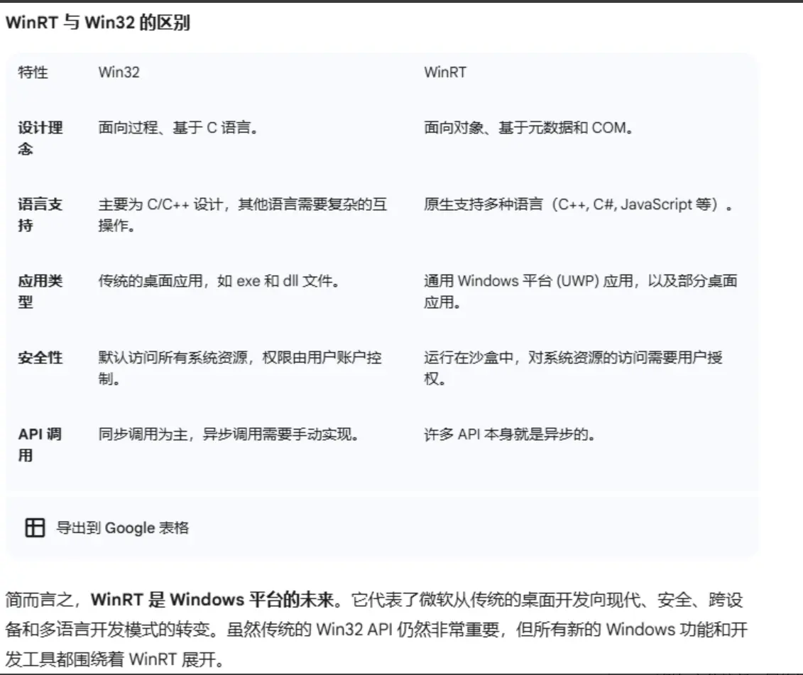

### WinRT

你可以把它理解为 Windows 平台的新一代 API，旨在取代传统的 Win32 API，以便更好地支持跨设备、跨语言的应用程序开发，它以现代、面向对象的方式取代了传统的 Win32 API。WinRT 的核心是基于 COM (Component Object Model) 的，但它添加了元数据（metadata）来支持多种编程语言，比如 C++, C#, JavaScript 等。

#### WinRT 的核心特性

1. 语言中立性（Language Neutrality）
这是 WinRT 最重要的特性。传统的 Win32 API 主要面向 C/C++，但 WinRT 使用了一种叫做**元数据（Metadata）** 的机制。这使得开发者可以使用多种编程语言来调用相同的 WinRT API，包括 C++、C#、JavaScript 和 Python。这大大方便了不同背景的开发者，并促进了跨语言组件的复用。

2. 面向对象
与传统的、基于过程调用的 Win32 API 不同，WinRT API 是一种完全面向对象的 API。你调用的每一个功能（例如文件访问、网络请求、UI 控件）都是一个对象，这使得 API 结构更清晰，使用更直观。

3. 异步化
WinRT 设计之初就考虑了异步编程。许多耗时操作（如网络下载、读取大文件）都是通过异步方式实现的。这可以防止应用程序在执行这些操作时卡顿，从而保持用户界面的流畅响应。

4. 安全和沙盒化
WinRT 应用（即 UWP 应用）运行在一个被称为“沙盒（Sandbox）”的隔离环境中。这意味着它们对系统资源的访问受到严格限制，需要通过用户的授权才能访问相机、麦克风或用户文件。这种设计极大地增强了应用的安全性。

---

### C++/CX

#### 特点

1. 语言扩展
扩展了C++语言语法及关键字。例如 `ref new` `ref class` ，类似于C++/CLI的做法

2. 推荐状态
**已过时**。微软已经不推荐。推荐C++/WinRT

3. 易用性
对于习惯于 .NET 或 C++/CLI 语法的开发者来说可能更直观，但其非标准的语法可能会让传统的 C++ 开发者感到困惑。

4. 兼容性
仅限于微软的 Visual C++ 编译器。
需要生成特定的 .cpp 和 .h 文件。

### C++/Winrt

#### 特点

1. 语言扩展
标准 C++ 库。它完全使用标准的 C++17 语言特性，例如智能指针 (shared_ptr, weak_ptr) 和 C++ 协程 (coroutine)。它是一个头文件库，不需要特殊的编译器扩展

2. 推荐状态
**强烈推荐**。C++/WinRT 是微软官方推荐的、用于访问 WinRT API 的现代方式。

3. 易用性
对于遵循标准 C++ 最佳实践的开发者来说更自然。它使用标准的 RAII (Resource Acquisition Is Initialization) 模式来管理资源，而不是特殊的引用计数语法。

4. 兼容性
因为是标准 C++，理论上可以被任何支持 C++17 的编译器编译（尽管主要是在 Visual Studio 中使用）。
作为一个纯粹的头文件库，使用起来更简单，更容易集成。