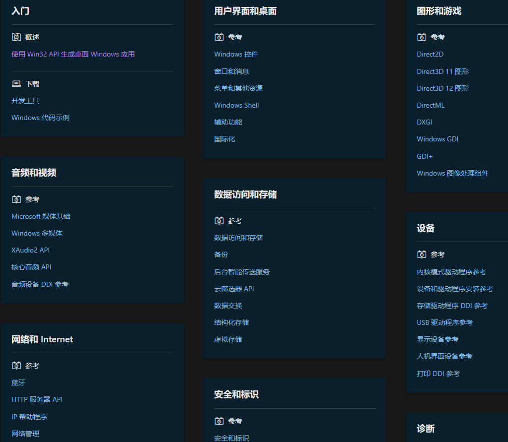
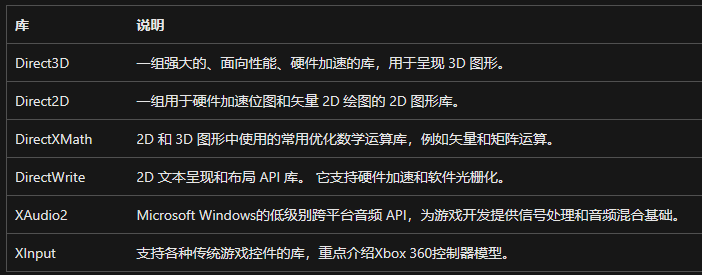

### Win32 Api

[开始使用 - Win32 apps | Microsoft Learn](https://learn.microsoft.com/zh-cn/windows/win32/desktop-programming)

Win32 API（也称为 ==Windows API==）是需要直接访问 Windows 和硬件的本机 C/C++ Windows 应用程序的原始平台。 它提供一流的开发体验，而无需依赖于适用于 Windows 10) 的 UWP 应用的托管运行时环境（如 .NET 和 WinRT (）。 这使得 Win32 API 成为需要最高级别性能和直接访问系统硬件的应用程序的首选平台。

[Win32 API 编程参考 - Win32 apps | Microsoft Learn](https://learn.microsoft.com/zh-cn/windows/win32/api/)

通过win32 API参考可以看到win32api提供的操作功能范围涉及到windows系统的方方面面，其实就是最原始的windows编程接口。windows操作系统之上的最底层的库

### COM
==组件对象模型==
[什么是 COM 接口 - Win32 apps | Microsoft Learn](https://learn.microsoft.com/zh-cn/windows/win32/learnwin32/what-is-a-com-interface-)

COM 是创建可重用软件**组件的规范**。 在基于新式Windows的程序中使用的许多功能都依赖于 COM。其实就是一堆接口，用于隔离应用调用和应用实现库而实现的一个接口库。

### windows sdk

[准备开发环境 - Win32 apps | Microsoft Learn](https://learn.microsoft.com/zh-cn/windows/win32/learnwin32/prepare-your-development-environment)

若要用 C 或 C++ 编写Windows程序，必须安装 Microsoft Windows 软件开发工具包 (SDK) 或者Microsoft Visual Studio。

windows sdk包含如下部分：
- Windows SDK 包含编译和链接应用程序所需的头文件和库文件。因为要使用c++生成windows应用程序，因此不仅包含标准库头文件库文件，还要包含面相特定版本的windows系统的系统api头文件和库文件（win32 api）
- Windows SDK 还包含用于生成Windows应用程序的命令行工具，包括 Visual C++ 编译器（MSVC）和链接器

### DirectX

DirectX 是用于开发==Windows游戏==的主要==图形 API 集==，该api集合用于操作GPU设备的，属于windows api的一部分，下载了windows sdk就可以使用directx功能了。

[使用 DirectX 进行开发的先决条件 - Win32 apps | Microsoft Learn](https://learn.microsoft.com/zh-cn/windows/win32/direct3dgetstarted/pre-requisites-for-developing-a-tailored-c---with-directx-app)

### UWP

==通用windows平台==
[什么是通用 Windows 平台 (UWP) 应用？ - UWP applications | Microsoft Learn](https://learn.microsoft.com/zh-cn/windows/uwp/get-started/universal-application-platform-guide)

UWP 是创建适用于 Windows 的客户端应用程序的众多方法之一。 UWP 应用使用 WinRT API 来提供强大的 UI 和高级异步功能，这些功能非常适用于 Internet 连接的设备。

### WinUI

### Windows应用SDK

### MSIX