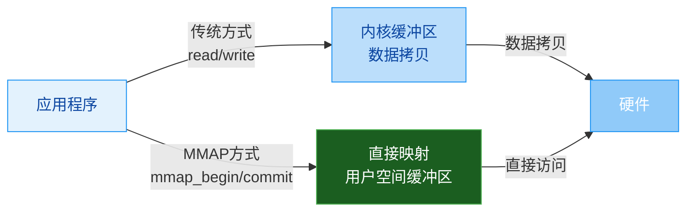

你提供的这个网页是 **ALSA（Advanced Linux Sound Architecture）项目** 中关于 **PCM（脉冲编码调制）接口的官方库参考文档**。它详细介绍了在 Linux 系统上使用 ALSA 库进行**数字音频编程**的各类接口、函数、数据结构及概念。下面我为你总结一下它的核心内容。

### 🧠 一、核心概念：PCM 数字音频基础

ALSA 将 PCM 理解为**通用的数字音频处理**，其核心是在连续时间周期内生成音量样本【turn0fetch0】。

*   **模拟信号数字化**：通过模数转换器（ADC）将模拟信号转换为数字值（特定时刻的音量），反之通过数模转换器（DAC）转换回模拟信号【turn0fetch0】。
*   **样本（Sample）**：一个数字值。
*   **帧（Frame）**：ALSA 的术语。在同一时间点从多个声道（如立体声的左右声道）采集或播放的一组样本的集合。**一帧可能包含一个样本（单声道）或多个样本（立体声、多声道）**【turn0fetch0】。
*   **数字音频流**：由在连续时间边界上记录的一系列帧组成【turn0fetch0】。

ALSA 使用**环形缓冲区（Ring Buffer）** 来存储播放（输出）和录音（输入）的样本，并通过两个指针（硬件指针和应用程序指针）实现精确通信【turn0fetch0】。

### 🔄 二、数据传输方式与I/O模型

ALSA 在 Unix 环境下提供了多种与音频设备交换数据的方法，其核心思想是将数据流分成小块（chunk），设备在每块传输完成后向应用程序发送确认【turn0fetch0】。

#### 1. 标准I/O传输（Read/Write）
这是最基础的方式，使用标准的 `read()` 和 `write()` 函数【turn0fetch0】。
*   **阻塞模式**：`read()`/`write()` 会等待直到有足够空间（播放）或数据（录音）。若设备被占用，`open()` 也会阻塞等待。
*   **非阻塞模式**：设置 `O_NONBLOCK` 标志。`read()`/`write()` **不会等待**，若条件不满足（如环形缓冲区满/空），立即返回 `-EAGAIN` 错误。`open()` 也会立即返回，若设备被占用则返回 `-EBUSY`【turn0fetch0】。

#### 2. 事件等待（Poll/Select）
使用 `poll()` 或 `select()` 系统调用。允许应用程序在**等待音频事件的同时**，也能等待其他文件描述符（如键盘、网络）的事件，实现多路复用【turn0fetch0】。
*   通过 `snd_pcm_poll_descriptors()` 获取需要监听的文件描述符。
*   使用 `snd_pcm_poll_descriptors_revents()` 来解混返回的事件。

#### 3. 异步通知（SIGIO）
通过 `SIGIO` 信号实现。当音频事件（如数据可读/写）发生时，**中断应用程序**，在信号处理程序中传输数据【turn0fetch0】。
*   需要使用 `sigaction()` 系统调用设置信号处理。
*   通过 `snd_async_add_pcm_handler()` 函数关联 PCM 流和异步处理程序。

下表对比了这三种传输方式的特点：

| 传输方式 | 核心机制 | 优点 | 缺点 | 适用场景 |
| :--- | :--- | :--- | :--- | :--- |
| **标准I/O (Read/Write)** | 直接调用读写函数 | **简单直观**，易于理解 | **效率较低**，频繁用户态/内核态切换 | **简单应用**，教学示例，或低需求场景 |
| **事件等待 (Poll/Select)** | 使用 `poll()`/`select()` 监听 | **高效**，可同时处理多个I/O源 | 编程模型相对复杂 | **需要高性能**或同时处理多种事件的应用 |
| **异步通知 (SIGIO)** | 信号驱动 | **响应及时**，不占用CPU轮询 | **编程复杂**，信号处理有诸多限制 | 对延迟极度敏感，且能处理复杂信号的应用 |

### 🎛️ 三、PCM设备状态机与状态管理

ALSA PCM API 的设计核心是**状态机**。设备始终处于一种特定状态，状态转换决定了应用程序与库之间的通信阶段【turn0fetch0】。通过 `snd_pcm_state()` 可查询当前状态。

| 状态名称 | 描述 | 转换至下一状态的典型操作 |
| :--- | :--- | :--- |
| **OPEN** | 设备刚被打开 (`snd_pcm_open()`), 或硬件参数设置失败后的状态。 | `snd_pcm_hw_params()` (成功) |
| **SETUP** | 设备已接受通信参数（格式、采样率、通道数等），等待准备。 | `snd_pcm_prepare()` |
| **PREPARED** | 设备已准备好，**等待开始**传输。可在此状态读写数据以**启动**流。 | `snd_pcm_start()` (显式启动) 或 写入/读取足够数据 (自动启动) |
| **RUNNING** | 设备**正在运行**，处理样本。 | `snd_pcm_drop()`, `snd_pcm_drain()`, `snd_pcm_pause()` (暂停), 发生 **XRUN** |
| **XRUN** | **发生错误**：**Underrun** (播放，数据未及时提供) 或 **Overrun** (录音，数据未及时取走)。 | `snd_pcm_prepare()` (恢复) 或 `snd_pcm_recover()` (自动恢复) |
| **DRAINING** | 录音时调用 `snd_pcm_drain()` 后，等待环形缓冲区中所有数据被读取。 | 缓冲区排空后自动进入 **SETUP** |
| **PAUSED** | 流被显式暂停 (`snd_pcm_pause()`)。**并非所有硬件都支持**。 | `snd_pcm_pause()` (恢复) |
| **SUSPENDED** | 系统因电源管理挂起驱动。 | `snd_pcm_resume()` (若硬件支持) 或 `snd_pcm_prepare()` |
| **DISCONNECTED** | 设备物理断开（如USB声卡拔出）。 | **无法通过标准API恢复**，需重新打开设备 |

> 💡 **重要提示**：**XRUN（Underrun/Overrun）** 是音频编程中最常见的错误，通常意味着应用程序的数据处理速度跟不上音频硬件的实时要求。**务必检查并处理**此错误。

### ⚙️ 四、参数管理：硬件与软件参数

ALSA 将参数分为**硬件参数**和**软件参数**，通过一种“参数精炼系统”来配置【turn0fetch0】。

#### 1. 硬件参数 (Hardware Parameters, `snd_pcm_hw_params_t`)
描述流的**硬件特性**，通常在流打开后设置一次。设置过程是：先选择所有配置的全集，然后逐步精炼至确定的单个值【turn0fetch0】。
*   **访问模式 (Access Modes)**：决定了数据在内存中的组织方式。
    *   `SND_PCM_ACCESS_MMAP_INTERLEAVED`：**直接映射**，交错存储（如LRLRLR），性能最高。
    *   `SND_PCM_ACCESS_MMAP_NONINTERLEAVED`：**直接映射**，非交错存储（每个通道单独缓冲区）。
    *   `SND_PCM_ACCESS_MMAP_COMPLEX`：**直接映射**，复杂内存组织，不适用于交错或非交错。
    *   `SND_PCM_ACCESS_RW_INTERLEAVED`：**读写方式**，交错存储。
    *   `SND_PCM_ACCESS_RW_NONINTERLEAVED`：**读写方式**，非交错存储。
*   **格式 (Format)**：指定样本的格式（如 `SND_PCM_FORMAT_S16_LE` 表示16位有符号小端整数）。通过 `snd_pcm_format_t` 枚举指定【turn0fetch0】。
*   **其他关键参数**：采样率 (`rate`)、通道数 (`channels`)、周期大小 (`period_size`)、缓冲区大小 (`buffer_size`) 等。

#### 2. 软件参数 (Software Parameters, `snd_pcm_sw_params_t`)
控制**驱动程序的行为**，**可以在运行时动态修改**【turn0fetch0】。
*   **启动阈值 (Start Threshold)**：控制流**何时自动启动**。对于播放，当环形缓冲区中的帧数达到此值且流未运行时，设备会自动启动流。若想显式启动，可将其设为大于缓冲区大小（如 `LONG_MAX`）【turn0fetch0】。
*   **停止阈值 (Stop Threshold)**：控制流**何时自动停止**。对于播放，当缓冲区中的空闲帧数超过此值时自动停止【turn0fetch0】。
*   **静音阈值 (Silence Threshold)**：在发生underrun前，向缓冲区填充静音样本的帧数。用于可能发生underrun的应用（如网络音频）【turn0fetch0】。
*   **最小可用帧数 (Minimum Available)**：控制唤醒点。当可用帧数达到此值时，应用程序会被激活（通常与 `poll` 或异步通知配合使用）【turn0fetch0】。

### 🧪 五、直接访问与零拷贝传输 (MMAP)

ALSA 提供 **直接访问环形缓冲区**的能力，这就是 **MMAP（内存映射）传输**，也称为“**零拷贝**”传输【turn0fetch0】。

*   **工作原理**：通过 `snd_pcm_mmap_begin()` 函数，应用程序**直接获取指向环形缓冲区内存区域的指针**，可以直接在该内存中读写数据。处理完成后，调用 `snd_pcm_mmap_commit()` 通知库数据已就绪，库更新指针【turn0fetch0】。
*   **巨大优势**：**避免了数据在用户空间和内核空间之间的多次拷贝**，**显著降低CPU占用和延迟**，是高性能音频应用的首选。
*   **兼容函数**：也提供了类似读写函数的兼容接口，如 `snd_pcm_mmap_writei()`，但它们内部会进行拷贝，**无法享受零拷贝的优势**【turn0fetch0】。

### 📊 六、获取状态与更新指针

应用程序需要**持续监控流的状态和缓冲区的可用空间**，以避免underrun/overrun并高效地传输数据。

| 函数 | 功能 | 特点 |
| :--- | :--- | :--- |
| **`snd_pcm_avail_update()`** | **更新并返回当前可用帧数**（播放时为可写入，录音时为已读取）。**最常用**，**必须在任何 `mmap_begin/commit` 或 `read/write` 前调用**。 | 轻量级，但精度**依赖中断**，可能在两次中断间返回相同值。 |
| **`snd_pcm_avail()`** | **读取硬件指针**并调用 `avail_update()`，返回**更精确的可用帧数**。 | 更精确，但需要**用户态/内核态切换**，开销稍大。 |
| **`snd_pcm_delay()`** | 返回延迟（帧数）。播放时：缓冲区中待发送的帧数；录音时：缓冲区中待捕获的帧数。 | **不更新指针**，之后仍需调用 `avail_update()`。 |
| **`snd_pcm_status()`** | 获取详细状态信息（状态、时间戳、延迟、最大可用帧数、ADC过载计数等）。 | 全面但开销最大，不用于高频循环。 |

> ⚠️ **重要**：**务必遵循“更新指针 -> 检查可用空间 -> 处理数据 -> 提交写入/读取”的流程**，这是稳定工作的基础。

### 🔌 七、设备命名与插件体系

ALSA 使用**字符串**来表示 PCM 设备，格式通常为 `plugin:arguments`，灵活且强大【turn0fetch0】。其配置文件默认位于 `/usr/share/alsa/alsa.conf`。

| 设备类型 | 格式示例 | 说明 |
| :--- | :--- | :--- |
| **默认设备** | `default` | 通常指向 `plughw:0,0`，提供软件格式转换和重采样。 |
| **硬件设备** | `hw:0,0`   `hw:Card,Device,Subdevice` | **直接访问硬件**，**性能最高**，但要求应用程序处理所有参数。 |
| **插件硬件设备** | `plughw:0,0` | **使用插件包装硬件设备**。插件（如 `plug`）会自动处理**格式转换、通道数转换、重采样**等，极大简化编程，是**通用应用的首选**。 |
| **文件设备** | `file:'/tmp/out.raw',raw` | 将流输出到文件或从文件输入，用于调试或生成测试文件。 |
| **空设备** | `null` | 空设备，数据写入后直接丢弃，用于测试。 |

ALSA 的插件体系（如 `plug`, `route`, `meter` 等）允许构建非常复杂的音频处理链路，无需修改应用程序。

### 🧵 八、线程安全与同步

*   **线程安全**：当库配置正确时，**许多高频调用的PCM函数（如 `snd_pcm_avail_update()`）是线程安全的**，可以从多个线程并发调用。但一些设置函数（如 `snd_pcm_hw_params()`）则**不是线程安全的**，需要应用程序自行同步【turn0fetch0】。
*   **流同步**：`snd_pcm_link()` 函数可以将**多个PCM流链接在一起**，使它们的操作（如启动、停止、暂停）**同步进行**。这适用于需要多个声卡或设备严格同步的场景（如多声道录音）。链接的前提是硬件本身支持同步【turn0fetch0】。

### 📌 总结与建议

这个网页是**ALSA PCM 编程的核心参考手册**。它涵盖了从概念、API到最佳实践的方方面面。

*   **对于初学者**：从**默认设备 (`plughw`)** 和**标准I/O（阻塞读写）** 开始，理解状态机和基本流程。逐步学习 `poll` 和 `mmap` 以提升性能。
*   **对于开发者**：**优先使用 `plughw` 设备**以利用插件简化参数处理。**强烈建议使用 MMAP（`snd_pcm_mmap_begin/commit`）方式**以获得最佳性能和最低延迟。**务必正确处理 XRUN 错误**。
*   **关键要点**：ALSA PCM 编程的核心是理解**状态机**、管理**缓冲区指针**、选择合适的**传输方式**和**设备类型**。

> 💡 **最后提醒**：ALSA 的官方文档是权威但枯燥的。结合 **ALSA 项目Wiki**、**示例代码**（如 `alsa-lib/test/pcm.c`）以及社区资源来学习会更容易上手。