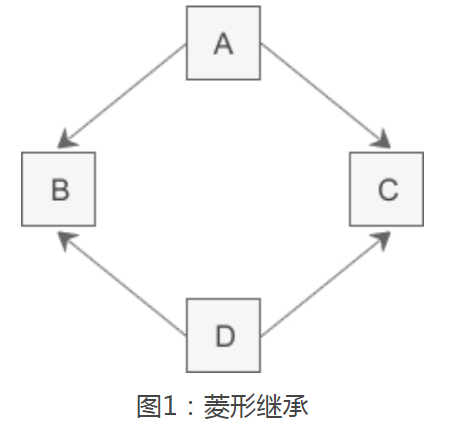
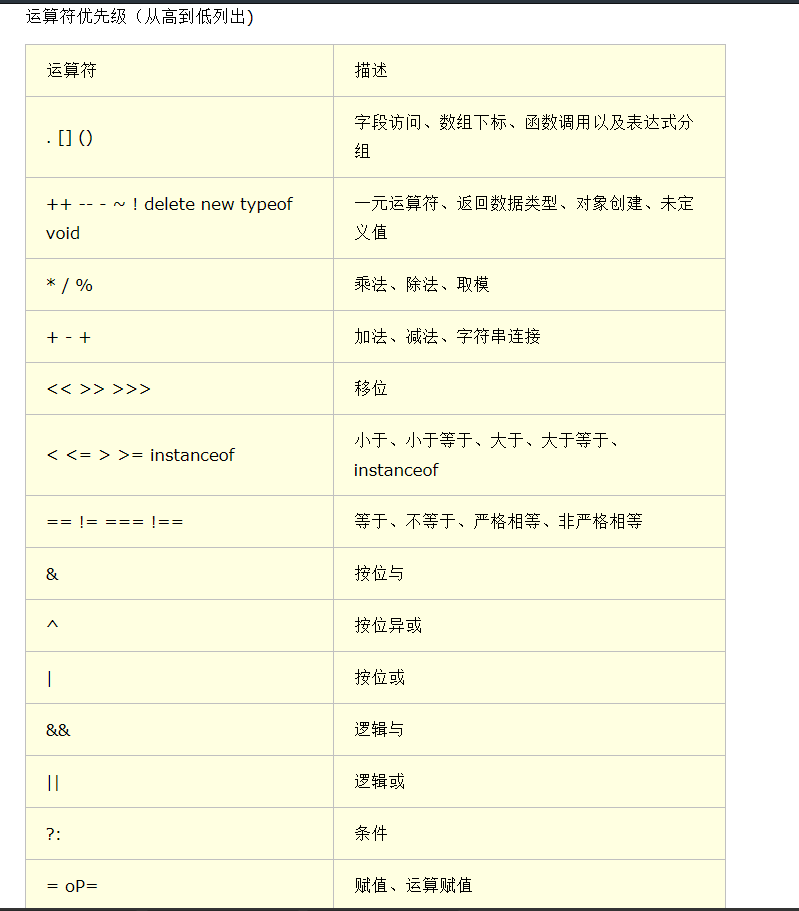
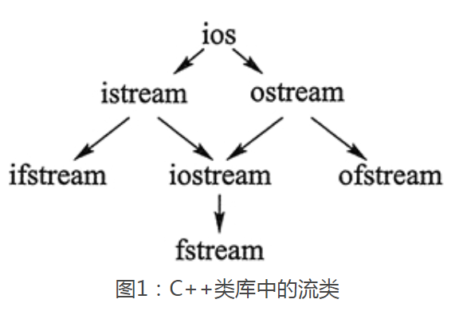
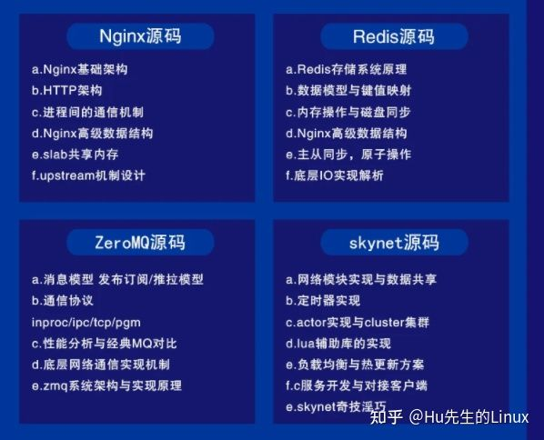
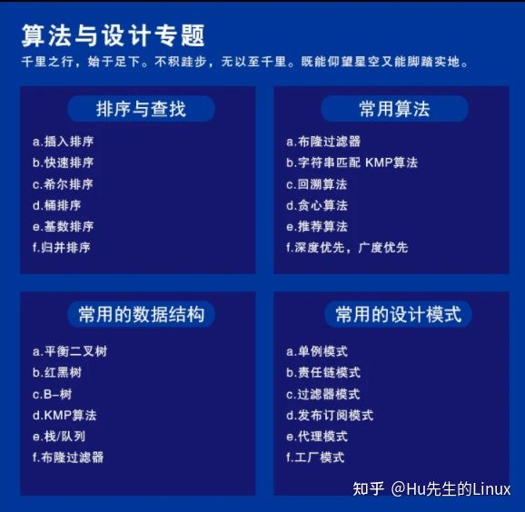
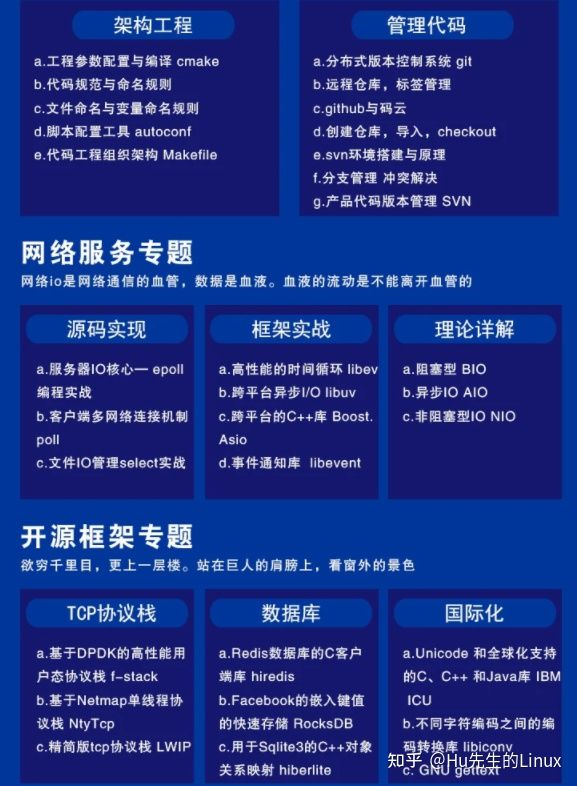
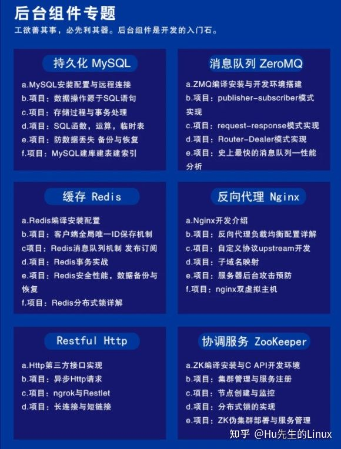
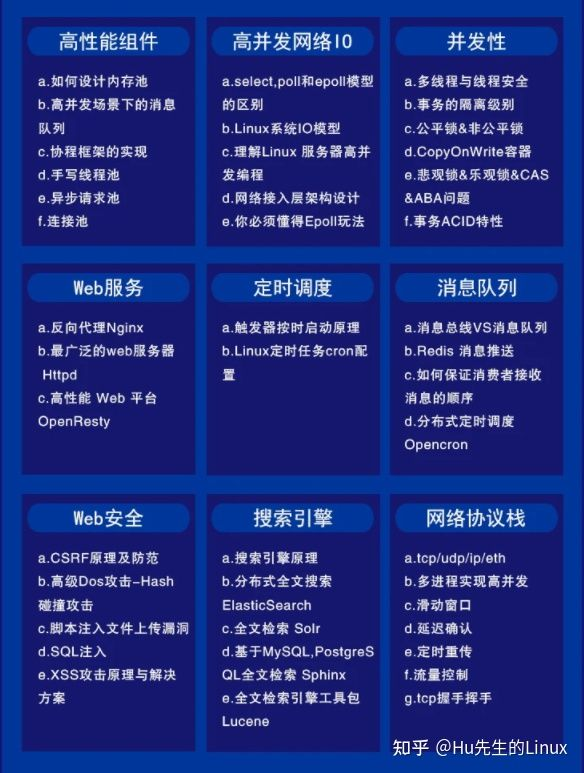

-----------
title: c++语言基础 
date: 2021/06/18 12:23:19

-----------


## c++语言官方网站及最新标准发布网站

>   https://isocpp.org/
>
>   https://en.cppreference.com/w/cpp/compiler_support


## C++标准（ISO/C++) 

>   c++标准只是一种规范，是对要实现功能的定义，规范只是规定了需要实现哪些内容，而具体如何实现就不属于规范范畴了。它包括
>
>   - **c++语言标准（实现：编译器gcc，msvc）**
>
>   - **c++标准库标准（实现：libc++，libstdc++）**


```
   c++标准库（std）的内容可以分为10类：
   
   1. 语言支持:<limits>,<climits>,<cfloat>,<cstdint>,<new>,<ctime>,<cstdlib>,<csignal>,
   2. IO操作:<iostream>,<ios>,<iosfwd>,<streambuf>,<istream>,<ostream>,<iomanip>,<sstream>,
   3. 诊断:<exception>,<stdexcept>,<cassert>,<cerrno>,<system_error>
   4. 通用工具：<utility>,<tuple>,<functional>,<memory>,<chrono>,<ctime>,<iterator>
   5. 字符串：<string>,<cctype>,<cwctype>,<regex>,<cwchar>,<cstdlib>,<cuchar>,<cstring>
   6. 容器：<deque>,<vector>,<list>,<map>,<queue>,<set>,<stack>,<array>,<bitset>,<forward_list>,<unordered_map>,<unordered_set>
   7. 并发：<atomic>,<thread>,<mutex>,<future>,<condition_variable>
   8. 算法：<algorithm>,<cstdlib>
   9. 数值操作：<numeric>,<complex>,<cmath>,<random>,<cstdlib>,<valarray>
   10. 本地化:<locale>,<clocale>,<condecvt>
```

   

**如果一个程序的功能完全使用标准库中的东西来实现的话，就可以做到跨平台（一份相同的代码，在不同操作系统上编译执行）。因为标准库中的东西其实只是接口（对功能的定义），具体到不同平台的c++标准库实现是不同的（gun/linux中是libstdc++，mac和ios中是libc++，android中是NDK），具体实现其实是对系统调用的使用来实现的。**


### stl
    stl由:容器,迭代器,算法,函数对象组成

#### 容器

>   [emplace_back()和push_back()区别和注意](https://www.cnblogs.com/zuofaqi/p/10194541.html)

```c++
队列：queue

//初始化
queue<T> que;//默认构造
queue(const queue &q);//拷贝构造

//操作
push(e);//add to tail
pop();//remove head
back();//get tail
front();//get head
size();//get size
empty();//if noting


```


##### unordered_set<T>

```cpp
#include <unordered_set>                // 0. include the library

int main() {
    // 1. initialize a hash set
    unordered_set<int> hashset;   
    // 2. insert a new key
    hashset.insert(3);
    hashset.insert(2);
    hashset.insert(1);
    // 3. delete a key
    hashset.erase(2);
    // 4. check if the key is in the hash set
    if (hashset.count(2) <= 0) {
        cout << "Key 2 is not in the hash set." << endl;
    }
    // 5. get the size of the hash set
    cout << "The size of hash set is: " << hashset.size() << endl; 
    // 6. iterate the hash set
    for (auto it = hashset.begin(); it != hashset.end(); ++it) {
        cout << (*it) << " ";
    }
    cout << "are in the hash set." << endl;
    // 7. clear the hash set
    hashset.clear();
    // 8. check if the hash set is empty
    if (hashset.empty()) {
        cout << "hash set is empty now!" << endl;
    }
}
```


#### 迭代器

```

```


#### 算法

```

```


#### 函数对象

```c++
class func
{
    void operator ()(int aa);
}
func a;//函数对象
a(3);


double fs(int a);
functional<double(int))> fo = bind(f,3);//fo为函数对象
```


#### 智能指针

>   std::unique_ptr
>
>   std::share_ptr
>
>   std::weak_ptr
>
>   enable_shared_from_this


---

## C++语法相关

​	

### 重要知识点

#### 对象初始化方式

- 显示调用：

  - stock s= stock();
  - stock* sp= new stock("hi",123);

- 隐式调用：

  - stock s;				-->调用默认构造函数

  - stock s("hello",123);	-->没有参数的时候不能写成这样stock s().该句是声明一个函数。要用上面的形式。

#### 对象是什麽

​	每一个新对象其实就是一块c-结构体空间。

​	stock s；的意思是在变量声明堆栈上开辟一块stock大小的内存空间，s是该区域的地址（相当于汇编中的标号）。

​	但调用构造函数之后就相当于对这块内存的对应区域进行了初始化。而不同对象是共用类的方法的，成员函数通过缺省的this指针知道该调用哪一个对象的数据来改变。

#### 构造函数：

​		默认构造函数:stock();								  -->stock a;
​		复制构造函数:stock(const stock&s);	 	-->stock a = stock(b);			使用一个对象来创建另一个对象
​																					stock a(b);
​																					stock* a= new stock(b);
​																					stock a=b;
​		移动构造函数:stock(const stock&&s);		-->
​		赋值操作符： stock& operator=(const stock &s);  --> a=b				将a对象重新赋值为b。

**必须使用成员初始化列表初始化的三种情况**

- const成员变量的初始化
- 引用成员的初始化
- 初始化没有默认构造函数的对象（该对象可能是继承来的，也可以是组合的对象）

#### 继承：

- 派生类和基类之间的关系：
  ​		1.派生类对象可以使用基类中的公有方法（派生类--》基类）
  ​		2.基类指针或引用可以指向派生类对象（基类--》派生类），但是该指针或引用只能访问派生类中基类的方法

- 3种继承方式（私有，保护，公有）改变的只是继承体系之外的使用派生类的访问权限，而对于继承体系之内（基类，派生类）基类中成员是什麽访问权限，对于派生类来说就是什么权限。

#### 多态：

- 同一个方法在基类和派生类中的行为不同，方法的行为取决于调用方法的对象。
- 实现方式：
      1.在派生类中重新定义基类需要实现多态的方法
  	2.使用虚方法(虚拟成员函数，在方法声明前加上virtual关键字)。编译器对虚方法采用 动态联编（将函数调用推迟到运行时决定）
- 动态联编的原因是：继承关系中的第二条。基类指针或引用可以指向派生类对象所导致的。

```c++
class A
{
public:
void funPrint(){cout<<"funPrint of class A"<<endl;};
};

class B:public A
{
public:
void funPrint(){cout<<"funPrint of class B"<<endl;};
};

void main()
{
A *p; //定义基类的指针
A a;
B b;
p=&a;
p->funPrint();
p=&b;
p->funPrint();
}
```

大家以为这段代码的输出结果是什么？有的人可能会马上回答funPrint of class A 与 funPrint of class B 因为第一次输出是引用类A的实 例啊，第二次输出是引用类B的实例啊。那么我告诉你这样想就错啦，答案是funPrintof class A 与 funPrint of class A。因为p是一个A类的指针，所以不管你将p指针指向类A或是类B，最终调用的函数都是类A的funPrint 函数。这就是**静态联篇**，编译器在编译的时候就已经确定好了。可是如果我想实现跟据实例的不同来动态决定调用哪个函数呢？这就须要用到 虚函数（也就是**动态联篇**）


---------------------------------------------------------------------


#### 虚基类




为了解决菱形继承体系下，类d，通过类b，类c两条途径获得类a数据的两份拷贝。和可能的命名冲突。通过让类b与类c使用**虚拟继承**类a来声明类a是共享的。来消除歧义

```c++
//间接基类A
class A{
protected:
    int m_a;
};

//直接基类B
class B: virtual public A{  //虚继承，则类A叫做虚基类
protected:
    int m_b;
};

//直接基类C
class C: virtual public A{  //虚继承
protected:
    int m_c;
};

//派生类D
class D: public B, public C{
public:
    void seta(int a){ m_a = a; }  //正确，如果类b，c没有声明为虚继承，则此处命名冲突
    void setb(int b){ m_b = b; }  //正确
    void setc(int c){ m_c = c; }  //正确
    void setd(int d){ m_d = d; }  //正确
private:
    int m_d;
};

int main(){
    D d;
    return 0;
}
```


---


#### 虚函数（多态）

```c++
class A
{
public:
virtual void funPrint(){cout<<"funPrint of classA"<<endl;};//虚函数
};

class B:public A
{
public:
virtual void funPrint(){cout<<"funPrint of classB"<<endl;};
};

void main()
{
A *p; //定义基类的指针
A a;
B b;
p=&a;
p->funPrint();
p=&b;
p->funPrint();
}
```

此时由于继承的A中调用函数是虚函数，编译器采用动态联编，结果就会出现多态性。同一个操作

（p->funprint），不同的结果。


---


#### 抽象类(纯虚函数)

类中含有纯虚函数的类，纯虚函数只是一个接口，没有实现（因此，抽象类无法被实例化）。

```c++
class Vehicle
{
public:
virtual void PrintTyre()=0; //纯虚函数是这样定义的.该类为抽象类
};

class Camion:public Vehicle //继承抽象类，要实现接口，如果不实现，则该类也是抽象类
{
public:
virtual void PrintTyre(){cout<<"Camion tyrefour"<<endl;};//virtual关键字不是必需的
};

class Bike:public Vehicle
{
public:
virtual void PrintTyre(){cout<<"Bike tyre two"<<endl;};
};

void main()
{
Camion c;
Bike b;
b.PrintTyre();
c.PrintTyre();
}
```


---


### 思考和其他

#### 对语言的一些思考

- 任何一门语言都需要有如下几方面的内容

  - 基本数据类型（int char [] {})
  - 基本运算和操作符（+ - * /）
  - 能够根据规则生成复杂的数据类型和操作（数据结构）
  - 分支循环（for if）
  - 代码段组织规则（函数）

  因为归根到底，计算机语言=数据（基本数据类型，复杂数据类型）+操作（操作符，自定义操作）。计算机语言是用来操作数据的，人们将现实问题建模转化为计算机能解决的问题（数据问题）然后通过计算机来解决。无论一个软件功能多复杂，分解到最后还是对数据结构的选择，对高效算法的设计。

  任何一个应用都可以分为两部分（IO操作+数据处理），IO操作部分涉及到的是操作系统和计算机网络，而数据处理就涉及数据结构和算法。

  

  在整个过程中软件的作用可以归纳如下：

  接受数据（操作系统api【类c语言】，或语言本身封装起来的形式）——》数据处理——》输出数据（同输入）。

  因此，软件的代码也就分为这两部分（输入输出部分的代码，数据处理的代码）

1. 编程的核心 = 数据 + 对数据的操作

2. **数据结构**：数据（组织方式）

3. **数据类型**：数据 + 操作

4. 每种语言都会有基本数据类型，通过将基本数据类型的组合可以构造出复合的符合场景的数据类型。
       <c>
   typedef struct stack                                  
   {                                                    
       int sk[10];                                        
       int incrsize 5;                                       
       int *top,*butt;
   }stack;//数据结构
   {
       //数据结构的操作
       void pop(stack &s);
       void push(stack &s);
       void top(stack &s);
   }    
       <c++>
   template<class T>
   class stack
   {
       vector<T> s;
           public:
               void pop();
               void push(T);
               void top();
   };//数据类型

   c++的基本单元 *类* == 数据类型
   c的面向过程式 将数据结构和操作分开。合起来才是完整的数据类型。

5. 学习一个新技术的难易，快慢。其实取决于我们对基础的技术和概念的理解程度。比如：线程池。其实只是在操作系统的线程上的一种新概念或技术

#### 字符编码问题

​	ANSI	各个国家的ansi编码不一样，中国的ansi为GBK编码，繁体中文为big5，日本的ansi为shift_jis
​	UTF-8	使用变长字节，包含世界上所有文字
​	UNICODE	使用2两个字节，统一使用2字节。且在内存中和在网络传输中都是unicode编码。
​	ASCII	使用1个字节，实际上是只使用7位，共表示128个文字。后128个可以扩展为其他字符

#### 各种操作符优先级



### c++11新特性

​	

#### const(常量)

> 作用：
>
> const ==> constant (adj.不变的,不可修改的)
>
> 起因：
>
> 使用场景：

1. ```c
   1. const char * a	
   
   2. char const *a
   
      上面两种都是指明*a的内容不可修改。
   
   3. char * const a
   
      代表指针a不可修改。
   
   4. void func() const
   
      代表被修饰函数不能修改任何成员变量值，不能调用非const函数。且不加const和加了const的同名函数是不一样的。
   
      
   ```

   

---

#### static(静态)

> static (adj.静态的，不会被删除的,可修改)
>
> 百度百科-static 		https://baike.baidu.com/item/static/9598919?fr=aladdin#1

**面向过程中**

静态全局变量:

	静态全局变量保存在<u>全局数据区</u>    (生命周期)
	未经初始化的静态全局变量会被程序自动初始化为0    (由于保存在全局数据区)
	静态全局变量在声明它的<u>整个文件都是可见</u>的，而在文件之外是不可见的    (作用域)

静态局部变量:

	静态局部变量保存在<u>全局数据区</u>    (生命周期)
	静态局部变量一般在声明处初始化，如果没有显式初始化，会被程序自动初始化为0  (由于保存在全局数据区)
	它始终驻留在全局数据区，直到程序运行结束。但其<u>作用域</u>为局部作用域    (作用域)

静态函数:

	静态函数不能被其它文件所用其
	它文件中可以定义相同名字的函数，不会发生冲突


**面向对象中**

静态数据成员:

	1. 静态数据成员是该类的所有对象所共有的。对该类的多个对象来说，静态数据成员只分配一次内存，供所有对象共用
	静态数据成员存储在全局数据区, 在没有产生类对象时其[作用域](https://baike.baidu.com/item/作用域)就可见，即在没有产生类的实例时，我们就可以操作它
	静态数据成员定义时要分配空间，所以不能在类声明中定义
	静态数据成员没有进入程序的全局名字空间，因此不存在与程序中其它全局名字冲突的可能性

静态成员函数:

```
它为类的全部服务而不是为某一个类的具体对象服务。普通函数相比，[静态成员](https://baike.baidu.com/item/静态成员)函数由于不是与任何的对象相联系，因此它不具有this指 针。从这个意义上讲，它无法访问属于类对象的非静态数据成员，也无法访问非静态成员函数，它只能调用其余的静态成员函数。下面举个静态成员函数的例子。
```


---

#### constexpr

> 语义是“常量表达式”，也就是在编译期可求值的表达式


---

#### explicit 

​	explicit构造函数是用来防止隐式转换的

```c++
class Test1
{
public:
    Test1(int n)
    {
        num=n;
    }//普通构造函数
private:
    int num;
};
//--------------------------------------------
class Test2
{
public:
    explicit Test2(int n)
    {
        num=n;
    }//explicit(显式)构造函数
private:
    int num;
};
//----------------------------------------------
int main()
{
    Test1 t1=12;//隐式调用其构造函数,成功
    Test2 t2=12;//编译错误,不能隐式调用其构造函数
    Test2 t2(12);//显式调用成功
    return 0;
}
```


---

#### =delete


---

#### =default


---

#### noexcept=default


---

#### noexcept


---

#### #ifdef	xxx


---

#### typedef

给类型定义别名

```c
typedef:(用来定义一种新数据类型。常用于c语言中，借此定义结构变量不需要写struct前缀。)
typedef int myint；
typedef int* pint；
typedef int fun(void);  fun* f=function; //f(void) 等价于function(void);
上面一条一般这样写
typedef int (\*fun)(void); fun f=function;
```


#### lambda表达式

> [C++ 中的 Lambda 表达式](https://docs.microsoft.com/zh-cn/cpp/cpp/lambda-expressions-in-cpp?redirectedfrom=MSDN&view=vs-2019)


>   [lambda 表达式的概念和基本用法](http://c.biancheng.net/view/3741.html)

**概念和形式：**

lambda 表达式定义了一个匿名函数，并且可以捕获一定范围内的变量。lambda 表达式的语法形式可简单归纳如下：

```c++
[ capture ] ( params ) opt -> ret { body; };
```

其中 capture 是捕获列表，params 是参数表，opt 是函数选项（一般就是mutable），ret 是返回值类型，body是函数体。


**捕获列表：**

lambda 表达式可以通过捕获列表捕获一定范围内的变量：

-   [] 不捕获任何变量。
-   [&] 捕获外部作用域中所有变量，并作为引用在函数体中使用（按引用捕获）。
-   [=] 捕获外部作用域中所有变量，并作为副本在函数体中使用（按值捕获）。
-   [=，&foo] 按值捕获外部作用域中所有变量，并按引用捕获 foo 变量。
-   [bar] 按值捕获 bar 变量，同时不捕获其他变量。
-   [this] 捕获当前类中的 this [指针](http://c.biancheng.net/c/80/)，让 lambda 表达式拥有和当前类成员函数同样的访问权限。如果已经使用了 & 或者 =，就默认添加此选项。捕获 this 的目的是可以在 lamda 中使用当前类的成员函数和成员变量。

```c++
// captures_lambda_expression.cpp
// compile with: /W4 /EHsc
#include <iostream>
using namespace std;

int main()
{
   int m = 0;
   int n = 0;
   [&, n] (int a) mutable { m = ++n + a; }(4); //m使用引用传递，n按值传递。mutable说明按值传递的n可以修改n值，等价于引用方式
   cout << m << endl << n << endl;
}
```


#### 函数对象


### CODE

多态使用：[多态](src\c++11语法\多态.cpp)

命名空间：[namespace](src\namespace.cpp)


## C++常用函数和编程问题汇总

### 网络编程

```c++
inet_ntoa()	int-->点分
inet_addr() 点分-->int
stoi(string s) 将字符串转为int
itos(int i) 将int转为string
```

### 并发与多线程

>   [thread::join和thead::detach](https://www.cnblogs.com/liangjf/p/9801496.html)
>   


RAII

1. lock_guard<mutex>
2. unique_lock<mutex> 		支持条件变量


### 流

> [c语言中文网](http://c.biancheng.net/view/272.html) 
>
> 

```c++
getline(src,dst);
gets(src);//可以无限读取，以回车结束读取
cin.get(box,box_size);//函数可以接收空格，遇回车结束输入。
cin.getline(box,box_size);//函数可以同cin.get()函数类似，也可接收空格，遇回车结束输入
```



- istream 是用于输入的流类，cin 就是该类的对象。
- ostream 是用于输出的流类，cout 就是该类的对象。
- ifstream 是用于从文件读取数据的类。
- ofstream 是用于向文件写入数据的类。
- iostream 是既能用于输入，又能用于输出的类。
- fstream 是既能从文件读取数据，又能向文件写入数据的类。


### mariadb数据库

mysql的开源版本，mysql被oracle公司收购。mysql之父又写了一个就是mariadb

**c连接mariadb或mysql的api**

```c
		//相关数据结构
		MYSQL：代表数据库连接
		MYSQL_SET:代表结果集和元数据
		MYSQL_ROW:一个字符指针数组，指针指向实际数据所在列
		MYSQL_FIELD:表示某一列的元数据
		MYSQL_STMT:表示准备好的语句句柄
		MYSQL_BIND:用于为准备好的语句提供参数，或为接受输出列的值
		MYSQL_TIME:用于日期和时间值

		//建立连接的相关函数
		mysql_init:准备并初始化MYSQL结构，该结构被mysql_real_connect使用
		mysql_real_connect:与要求的数据库进行连接，并返回MYSQL句柄
		mysql_thread_init:用于多线程的程序
		mysql_options:用于设置额外的连接选项，并影响连接行为======mysql_optionsv()
		mysql_close:关闭一个之前打开的连接

		//查询相关函数
		mysql_query:执行一个语句(二进制不安全的：读取字符串时考虑字符转义的问题。二进制安全：不考虑字符转义的问题。)
		mysql_real_query:执行一条语句(二进制安全)
		mysql_hex_string:允许语句中出现16进制
		mysql_store_result:返回一个结果集
		mysql_free_result:释放store分配的动态内存
		mysql_use_result:用于初始化上一次查询结果集的索引值
		mysql_select_db:选择另一个数据库
		mysql_send_query:

		//行列相关的操作
		mysql_num_fields:列数
		mysql_field_count:
		mysql_field_seek:
		mysql_field_tell:
		mysql_fetch_field:
		mysql_fetch_fields:
		mysql_fetch_field_direct:

		mysql_num_rows:行数
		mysql_row_seek:
		mysql_row_tell:

		mysql_affected_rows:被影响的行数


		//工具函数
		mysql_ping:检测和服务器的连接是否在工作c
		mysql_error:
```


## 后台开发指南

>   [C++后台开发，以我之见](https://zhuanlan.zhihu.com/p/352365043)
>
>   

















>   [如何从事游戏后台开发？](https://www.zhihu.com/question/62386941)

