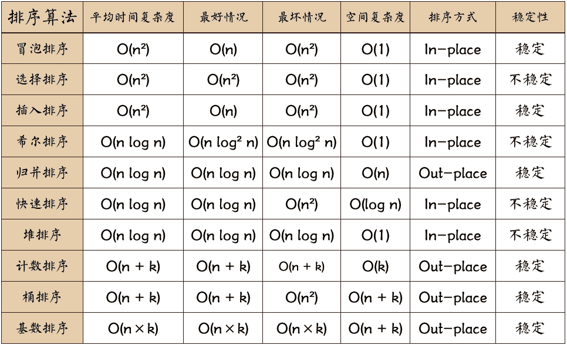
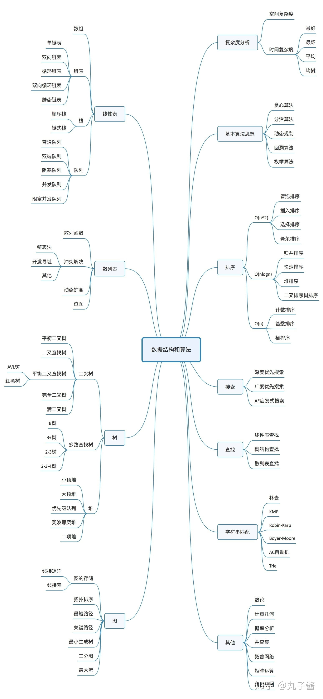

# 数据结构与算法

[如何系统地学习算法？ - 知乎 (zhihu.com)](https://www.zhihu.com/question/20588261/answer/926157817)

## 数据结构与算法

### 数组

### 链表

### 栈

### 队列

### 堆

### 树，二叉树
- 层序遍历
步骤：
- 已知前序，中序求树。已知中序和后序求树。
步骤:

### 图

 
 

## 10大排序算法

[十大经典排序算法动画与解析，看我就够了！（配代码完全版） (qq.com)](https://mp.weixin.qq.com/s?__biz=MzUyNjQxNjYyMg==&mid=2247484184&idx=1&sn=62965b401aa42107b3c17d1d8ea17454&chksm=fa0e6c99cd79e58f298e9026f677f912bd8c8e55edb48fc509b2b5834f05e529a9b47d59d202&scene=21#wechat_redirect)

十大排序算法的时空复杂度如下图

#### 快速排序(1)

> - 从数列中挑出一个元素，称为 “基准”（pivot）;
> - 重新排序数列，所有元素比基准值小的摆放在基准前面，所有元素比基准值大的摆在基准的后面（相同的数可以到任一边）。在这个分区退出之后，该基准就处于数列的中间位置。这个称为分区（partition）操作；
> - 递归地（recursive）把小于基准值元素的子数列和大于基准值元素的子数列排序；

#### 归并排序(2)

> - 申请空间，使其大小为两个已经排序序列之和，该空间用来存放合并后的序列；
> - 设定两个指针，最初位置分别为两个已经排序序列的起始位置；
> - 比较两个指针所指向的元素，选择相对小的元素放入到合并空间，并移动指针到下一位置；
> - 重复步骤 3 直到某一指针达到序列尾；
> - 将另一序列剩下的所有元素直接复制到合并序列尾。

#### 插入排序

> - 将第一待排序序列第一个元素看做一个有序序列，把第二个元素到最后一个元素当成是未排序序列。
> - 从头到尾依次扫描未排序序列，将扫描到的每个元素插入有序序列的适当位置。（如果待插入的元素与有序序列中的某个元素相等，则将待插入元素插入到相等元素的后面。）

#### 冒泡排序

> - 比较相邻的元素。如果第一个比第二个大，就交换他们两个。
> - 对每一对相邻元素作同样的工作，从开始第一对到结尾的最后一对。这步做完后，最后的元素会是最大的数。
> - 针对所有的元素重复以上的步骤，除了最后一个。
> - 持续每次对越来越少的元素重复上面的步骤，直到没有任何一对数字需要比较。

#### 选择排序

> - 首先在未排序序列中找到最小（大）元素，存放到排序序列的起始位置
> - 再从剩余未排序元素中继续寻找最小（大）元素，然后放到已排序序列的末尾。
> - 重复第二步，直到所有元素均排序完毕。

#### 计数排序

> - 花O(n)的时间扫描一下整个序列 A，获取最小值 min 和最大值 max
> - 开辟一块新的空间创建新的数组 B，长度为 ( max - min + 1)
> - 数组 B 中 index 的元素记录的值是 A 中某元素出现的次数
> - 最后输出目标整数序列，具体的逻辑是遍历数组 B，输出相应元素以及对应的个数

#### 基数排序

> - 将所有待比较数值（正整数）统一为同样的数位长度，数位较短的数前面补零
> - 从最低位开始，依次进行一次排序
> - 从最低位排序一直到最高位排序完成以后, 数列就变成一个有序序列

#### 堆排序

> - 创建一个堆 H[0……n-1]；
> - 把堆首（最大值）和堆尾互换；
> - 把堆的尺寸缩小 1，并调用 shift_down(0)，目的是把新的数组顶端数据调整到相应位置；
> - 重复步骤 2，直到堆的尺寸为 1。

#### 桶排序

> - 设置固定数量的空桶。
> - 把数据放到对应的桶中。
> - 对每个不为空的桶中数据进行排序。
> - 拼接不为空的桶中数据，得到结果

#### 希尔排序

> - 选择一个增量序列 t1，t2，……，tk，其中 ti > tj, tk = 1；
> - 按增量序列个数 k，对序列进行 k 趟排序；
> - 每趟排序，根据对应的增量 ti，将待排序列分割成若干长度为 m 的子序列，分别对各子表进行直接插入排序。仅增量因子为 1 时，整个序列作为一个表来处理，表长度即为整个序列的长度。

### 查找、插入、删除

静态查找
	|----- 顺序查找
	|----- 二分查找
动态查找
	|----- 二叉查找树
				+添加平衡条件
	|			|----- 平衡二叉AVL
				|----- 红黑树
	|----- B树和B+树			
	|----- 哈希查找

-----------------------------------
为什么可以用不同的语言来实现数据结构和算法？

答：数据结构是一种抽象概念，独立于语言和平台，代表着数据和信息在计算机**内存**中的组织方式。不同语言都有独特的原子数据类型和运算符，代表着不同的语言设计理念。但归根结底语言的作用就两个：

1.存储和表示数据（信息）【每种语言都有独特的原子数据类型如c语言中的数组，int，指针。python中的列表，字典，集合。都是用来存放数据的容器】。

2.操作数据【每种语言都有运算符（逻辑运算符，算术运算符，）代表着如何操控数据】。

于是，各种语言都可以使用语言本身的原子数据结构和操作运算符。将数据在内存中存储和操作了。

---------------------

如何学习排序算法：

​	单纯地去练习算法还是不好，以应用场景为导向才是正确姿势。要明白算法是解决什么样的问题而产生的。

### 待办

- [ ] 10个数据结构：数组，链表，栈，队列，二叉树，图，堆，散列表，跳表，trie树
- [ ] 10个算法：递归，二分查找，搜索，排序，哈希算法，贪心算法，分治算法，动态规划，字符串匹配算法

动态规划(DP)

1. 字符串转为整形---hash算法
2. 字符串正则提取

