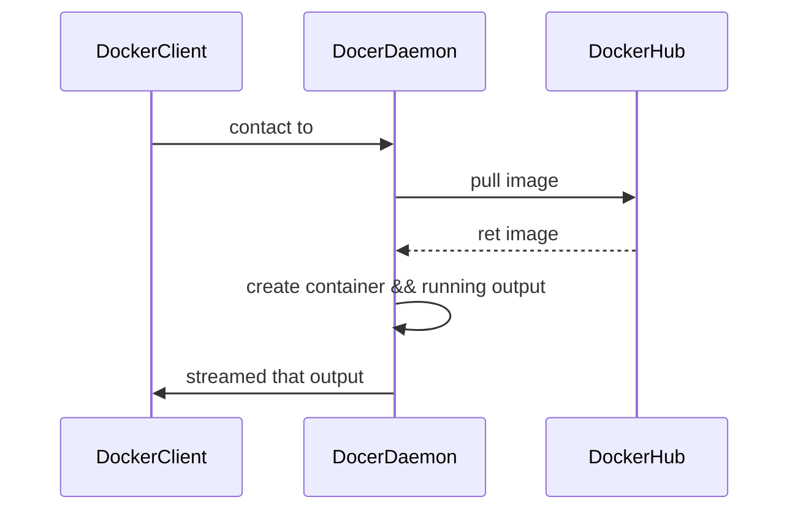

### docker学习文档

> [Dockerfile reference | Docker Documentation](https://docs.docker.com/engine/reference/builder/)
> [Docker Documentation | Docker Documentation](https://docs.docker.com/)


## 目录
---
是什么
参考文档
	docker命令行参考
	API参考
	Dockerfile参考
	Compose file参考
	驱动和规范文档


#### install(on centos7)
1. curl -sSL https://get.daocloud.io/docker | sh

2. systemctl start docker

3. docker run hello-world

#### 基本原理



#### 配置国内源

1. 创建或修改 /etc/docker/daemon.json 文件，修改为如下形式 

   ```json
   {    
       "registry-mirrors" : 
       			[    
       				"https://registry.docker-cn.com",   
       				"https://docker.mirrors.ustc.edu.cn",    
       				"http://hub-mirror.c.163.com",    
       				"https://cr.console.aliyun.com/"  
   				] 
   }
   ```

2. 重启docker服务

   systemctl restart docker


#### 常用命令

1. 为client创建一个伪终端

   docker run -it 镜像名 /bin/bash

2. 查看运行过的容器

   docker ps （-a详细信息）

3. 不使用缓存构建镜像
	docker build -t xxx --no-cache .

4. 将容器内的端口映射到本机指定端口
	docker run -p <host_port>:<container_port> <img_name>

5. 替换镜像指定的cmd运行容器，异常退出调试有用
	docker run -it --entrypoint /bin/bash <img_name>

#### Dockerfile

