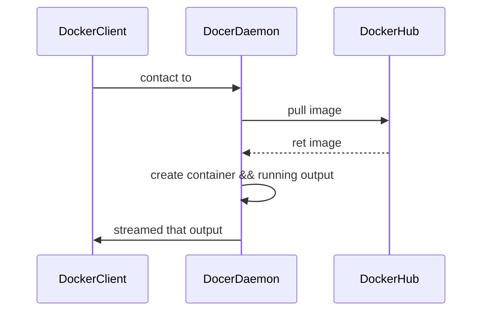

### docker

#### install(on centos7)
1. curl -sSL https://get.daocloud.io/docker | sh

2. systemctl start docker

3. docker run hello-world

#### 基本原理


```mermaid
sequenceDiagram

participant cl as DockerClient
participant sv as DocerDaemon
participant hb as DockerHub

cl->>sv:contact to 
sv->>hb:pull image
hb-->>sv:ret image
sv->>sv:create container && running output
sv->>cl:streamed that output
```

#### 配置国内源

1. 创建或修改 /etc/docker/daemon.json 文件，修改为如下形式 

   ```json
   {    
       "registry-mirrors" : 
       			[    
       				"https://registry.docker-cn.com",   
       				"https://docker.mirrors.ustc.edu.cn",    
       				"http://hub-mirror.c.163.com",    
       				"https://cr.console.aliyun.com/"  
   				] 
   }
   ```

2. 重启docker服务

   systemctl restart docker


#### 常用命令

1. 为client创建一个伪终端

   docker run -it 镜像名 /bin/bash

2. 查看运行过的容器

   docker ps （-a详细信息）

