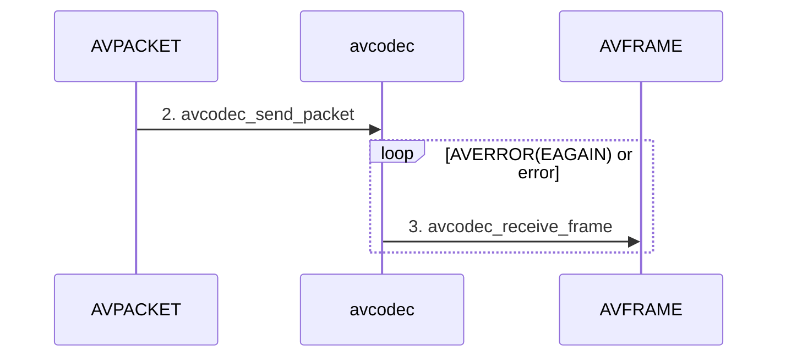

## ffmpeg 

### configure
wsl无法使用ffplay播放视频的问题。
```

1. 下载vcxsrv，
2. 在配置文件中配置display
3. 下载sdl2-dev库

```

ffmpeg无法推h264流
```

1. 下载libx264库，编译安装
    编译命令: configure --system-libx264 --enable-shared && make && sudo make install
2. 重新编译ffmpeg
    configure --enable-shared --enable-libx264 --enable-gpl
    make -j32
    sudo make install
```


### 术语表


1. 分辨率
2. 视频码率
3. 帧率


## ffmpeg库使用

### libavcodec**

**Decode流程**
将压缩的av流，通过avcodec解压缩为原始数据




