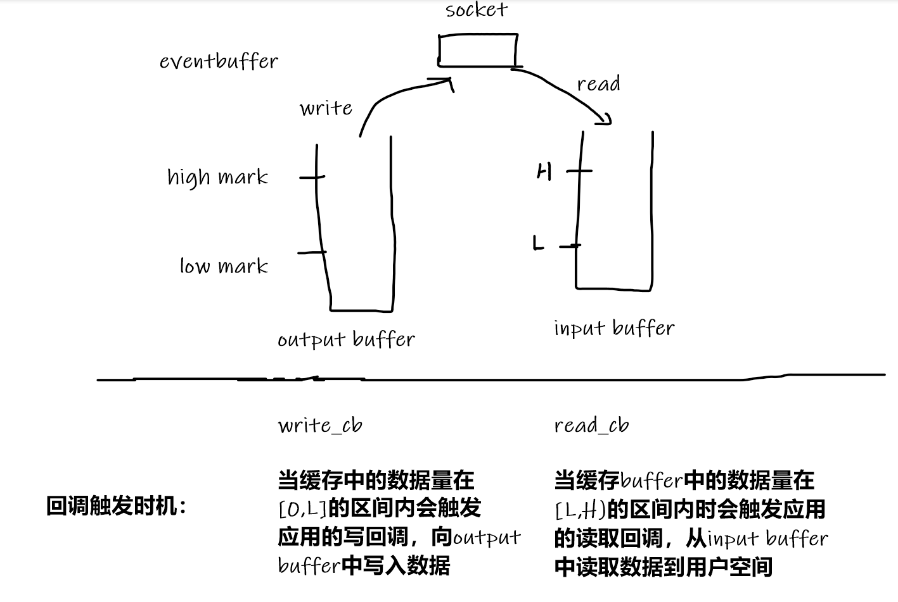

## 标准使用流程

### 1. Creating an event base

```c
struct event_base *event_base_new(void);
创建event-base结构体

struct event_config *event_config_new(void);
struct event_base *event_base_new_with_config(const struct event_config *cfg);
void event_config_free(struct event_config *cfg);
使用特定的配置(event_config)来创建一个event_base。event_config_new只是创建一个结构体，具体的配置需要使用如下的函数来配置。

int event_config_avoid_method(struct event_config *cfg, const char *method);
int event_config_require_features(struct event_config *cfg,
                                  enum event_method_feature feature);<br>
int event_config_set_flag(struct event_config *cfg,
    enum event_base_config_flag flag);
使用上述的函数接口来配置event_config结构体。

```

```c++
//获取本机支持的底层事件机制（select，poll，epoll）。最后一个字符串是null
const char **event_get_supported_methods(void);
// 获取当前event_base使用的哪个机制
const char *event_base_get_method(const struct event_base *base);
 //获取当前event_base机制支持的features
enum event_method_feature event_base_get_features(const struct event_base *base);

// 释放event_base。但不会释放管理的event，和涉及到的file description及指针
void event_base_free(struct event_base *base);
```
 


### 2. Create a event and add it to `event_base`
<br>
2.1 event的状态机模型
initialized<br>
|<br>
pending<br>
|<br>
active<br>
|--------[persistent]----pending<br>
no pending<br>
<br>
当使用event_new创建一个event之后，event就处于initialized状态。<br>
使用event_add将该event添加到event_base中之后，该event就处于pending状态<br>
当event监听的相应事件发生之后，会触发event的回调。此时的event就处于active状态<br>
回调执行完成之后，如果event之前设置为persistent。则event又进入pending状态进入监听状态<br>
如果没有设置为persistent，回调执行一次之后event就退出pending状态<br>
此时可以使用event_del将结束的event带入到no pending状态，或者使用event_add再次带入pending状态。<br>
<br>

<br>
<b>
#define EV_TIMEOUT      0x01<br>
#define EV_READ         0x02<br>
#define EV_WRITE        0x04<br>
#define EV_SIGNAL       0x08<br>
#define EV_PERSIST      0x10<br>
#define EV_ET           0x20<br>
</b>
支持的事件类型，最后两个时用来设置file description的属性。<br>
<br><br>


<b>
typedef void (*event_callback_fn)(evutil_socket_t, short, void *);<br>

struct event *event_new(struct event_base *base, evutil_socket_t fd, short what, event_callback_fn cb, void *arg);
<br>
void event_free(struct event *event);
</b>
创建(将事件带入initilized状态)和销毁事件。
<br>
<b>
int event_add(struct event *ev, const struct timeval *tv);
int event_del(struct event *ev);
int event_remove_timer(struct event *ev);

</b>
- 将event带入pending状态<br>
- 将event带入no pending状态，处于initialized和pending之间的一个状态<br>
- 移除event所带的定时器事件<br>
<br>


### run the event_base
```c
#define EVLOOP_ONCE             0x01<br>
#define EVLOOP_NONBLOCK         0x02<br>
#define EVLOOP_NO_EXIT_ON_EMPTY 0x04<br>
int event_base_loop(struct event_base *base, int flags);
使用某一种方式运行event_base。EVLOOP_ONCE等待并运行完成所有事件。EVLOOP_NONBLOCK巡逻式的检查是否有event激活。
int event_base_dispatch(struct event_base *base);
使用默认的方式（一直运行，直到没有注册的事件，或者调用event_base_loopbreak,event_base_loopexit来强制结束事件循环）运行
```


```c
int event_base_loopexit(struct event_base *base,
                        const struct timeval *tv);
int event_base_loopbreak(struct event_base *base);
终止loop。

```

```c
void event_base_dump_events(struct event_base *base, FILE *f);
用于调试，将event_base当前持有的事件写入文件中。
```


## Some useful utility


```c
struct event_base:
struct event:
struct bufferevent:
struct evbuffer:

    struct evbuffer *evbuffer_new(void);
    void evbuffer_free(struct evbuffer *buf);

    int evbuffer_enable_locking(struct evbuffer *buf, void *lock);
    void evbuffer_lock(struct evbuffer *buf);
    void evbuffer_unlock(struct evbuffer *buf);

    size_t evbuffer_get_length(const struct evbuffer *buf);
    size_t evbuffer_get_contiguous_space(const struct evbuffer *buf);

    int evbuffer_add(struct evbuffer *buf, const void *data, size_t datlen);
    int evbuffer_add_printf(struct evbuffer *buf, const char *fmt, ...)
    int evbuffer_add_vprintf(struct evbuffer *buf, const char *fmt, va_list ap);
    int evbuffer_expand(struct evbuffer *buf, size_t datlen);
    
    int evbuffer_add_buffer(struct evbuffer *dst, struct evbuffer *src);
    int evbuffer_remove_buffer(struct evbuffer *src, struct evbuffer *dst, size_t datlen);

```

###  对libevent中Bufferevents的water-mark的理解


> 每一个bufferevent结构都有一个input buffer和output buffer(均为evbuffer结构).当有数据往bufferevent中写时，bufferevent就会将要写入的数据添加到output buffer中。反过来，当bufferevent中有数据可读时，你可以从bufferevent中的input buffer提取出数据

每一个bufferevent结构都有两个与数据相关的回调：读回调(read callback)和写回调(write callback)。默认情况下，读回调会当底层传输机制(epool,poll,iocp)有数据可读时触发回调，而写回调只有output buffer中还有空间可写时调用。用户可以通过设置读和写的watermarks(水位)来改变数据收发的时机




> Reference: 
> http://www.wangafu.net/~nickm/libevent-book/
