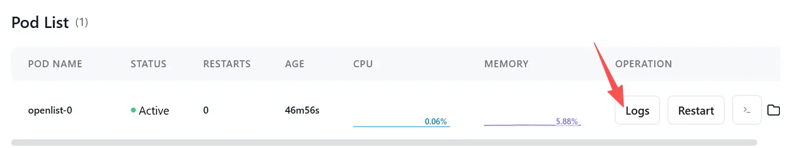

是 `alist` 开源继承者，用于各种网盘内容聚合


### 部署

基于PaaS（platform as a service）平台即服务，可以通过openlist的docker镜像进行openlist的快速部署。目前 `Claw Cloud` 每个月有5美元的免费额度可以使用，对于我们部署这个服务作为 #资源床 提供链接应该是足够的，订阅一个日程，一个月后登录看看使用量

1. 登录 [Claw Cloud](run.claw.cloud)  使用github账号
2. 通过AppLauchpad创建docker容器
3. 使用专为paas做了优化的docker镜像 [Qxad/openlist-for-PaaS: 一个openlist改版，使其更方便在PaaS平台部署使用。](https://github.com/Qxad/openlist-for-PaaS?tab=readme-ov-file) 
	```bash
	# 在Image那一栏中填入
	liu0223/oplist-fp
	```
4. 容器的资源情况使用默认的即可，大概$0.05美金最后部署下来，远小于每月送的5美刀。最后的Storage存储（避免重启之后内容消失）填写 `/opt/openlist/data` 
5. 容器运行起来之后，在容器控制界面 `pod list` 中点击Log按钮，可以看到openlist服务的初始化登录密码

6. 根据 `Network` 中提供的服务访问链接，和默认用户名密码登录进去修改一下用户名和密码
7. 增加存储：[中国移动云盘 - OpenList 文档](https://doc.oplist.org/guide/drivers/139#%E6%96%B0%E4%B8%AA%E4%BA%BA%E4%BA%91) 可以参考这里的新个人云获取Authorities和公开目录的目录ID，填写到openlist中即可