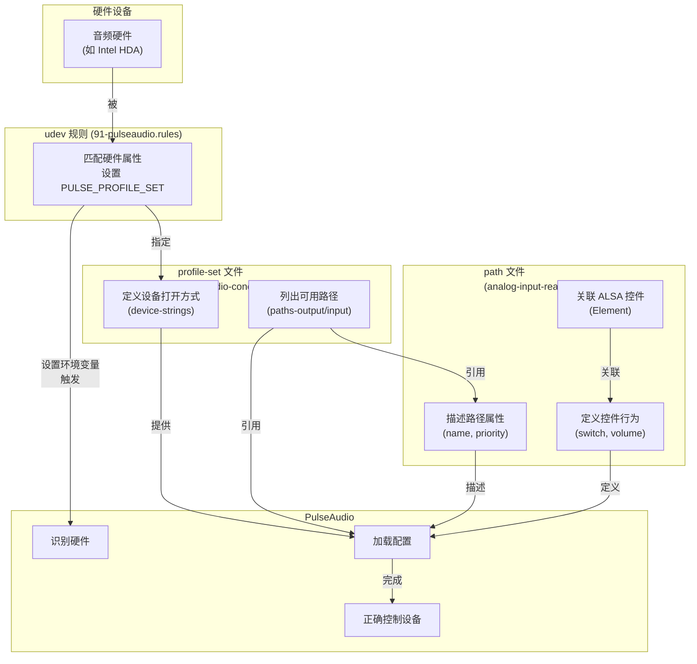

https://www.freedesktop.org/wiki/Software/PulseAudio/Backends/ALSA/Profiles/


你提供的这个网页是 **PulseAudio 官方文档**中关于如何为非标准音频硬件编写自定义配置文件（Profiles）的指南。它主要面向那些音频硬件**无法被 PulseAudio 自动识别或配置**的用户，希望通过手动配置让硬件更好地与 PulseAudio 协同工作【turn0fetch0】。

下面我为你梳理和解读这份文档的核心内容。

### 🧠 一、核心目的与适用场景

编写 PulseAudio 配置文件主要是为了解决以下问题【turn0fetch0】：

| 适用场景 | 具体表现 |
| :--- | :--- |
| **硬件设备名称非标准** | 硬件无法被 PulseAudio 默认的 `front:x` 等字符串打开，且未在 ALSA 库层（`/usr/share/alsa/cards/`）修复此问题。 |
| **音量控件名称非标准** | 硬件音量控制名称不常见（如 `"Megaphone"`, `"Leslie speaker"`），而非 `"Master"`, `"PCM"`, `"Headphone"` 等标准名称。 |
| **存在特殊功能开关** | 硬件有一些特殊开关（如 `"Ultra Disturb-Your-Neighbour Boom Bass"`），希望在 UI 中暴露控制。 |

> 💡 **核心思想**：通过配置文件，**告诉 PulseAudio 如何正确地打开、识别、路由和控制你的特定音频硬件**，使其行为符合 PulseAudio 的预期，从而在音量控制、设备路由等方面获得更好的体验。

---

### ⚙️ 二、配置流程与核心文件

> [!Note]
> 如果安装了 `alsa-ucm-conf` ，pulsuaudio会忽略自己的配置文件，而是尝试alsa ucm的配置。当发现按照下方的配置无效的时候。可以尝试修改pulseaudio的配置文件 `/etc/pulse/default.pa`
> ```
> load-module module-udev-detect use_ucm=0
> ```


要让 PulseAudio 正确识别你的硬件，需要完成以下**三个主要步骤**【turn0fetch0】：


#### 1. 编写 udev 规则 (udev rule)
**目的**：让系统在检测到你的特定硬件时，**自动加载你为它编写的自定义 PulseAudio 配置集**。

*   **位置**：通常放在 `/lib/udev/rules.d/90-pulseaudio.rules` 或创建新文件如 `/lib/udev/rules.d/91-pulseaudio.rules`。
*   **作用**：通过匹配硬件属性（如 PCI 厂商/设备 ID），设置一个环境变量 `PULSE_PROFILE_SET`，其值为你的配置文件名。
*   **示例**：

    ```bash
    # 首先获取到需要配置的声卡的vendor id和product id
    $ pactl list cards
		Card #0
		        Name: alsa_card.pci-0000_00_1b.0
		--- snip ---
		        Properties:
		--- snip ---
		                device.vendor.id = "8086" # This is a 'vendor' attribute for udev rule
		                device.product.id = "1c20" # This is a 'device' attribute for udev rule
    
    # 示例：匹配特定 Intel HD Audio 设备
    SUBSYSTEM!="sound", GOTO="pulseaudio_end"
    ACTION!="change", GOTO="pulseaudio_end"
    KERNEL!="card*", GOTO="pulseaudio_end"
    SUBSYSTEMS=="pci", ATTRS{vendor}=="0x8086", ATTRS{device}=="0x1c20", ENV{PULSE_PROFILE_SET}="pulseaudio-conexant.conf"
    LABEL="pulseaudio_end"
    ```
    此规则会在检测到满足条件的声卡时，告诉 PulseAudio 使用 `pulseaudio-conexant.conf` 这个配置集。

#### 2. 编写 profile-set 文件 (profile set)
**目的**：定义**如何打开 ALSA 设备**，并指定该配置集下可用的**音频路径**（Paths）。

*   **位置**：必须放在 `/usr/share/pulseaudio/alsa-mixer/profile-sets/` 目录下。
*   **文件名**：通常与 udev 规则中指定的名称一致（如 `pulseaudio-conexant.conf`）。
*   **核心内容**：使用类似 INI 格式的配置文件。
    ```ini
    # 示例：profile-set 文件片段
    [Mapping analog-stereo]
        device-strings = front:%f hw:%f
        channel-map = left,right
        paths-output = analog-output analog-output-speaker analog-output-headphones
        paths-input = analog-input-front-mic analog-input-rear-mic
        priority = 10
    ```
    **关键字段解释**：
    *   `[Mapping ...]`：定义一个设备映射，是配置集的核心单元。
    *   `device-strings`：PulseAudio 用来**打开 ALSA 设备的字符串**。`%f` 会被替换为卡号，**必须包含**。可指定多个尝试顺序。
    *   `channel-map`：指定通道映射（如立体声为 `left,right`）。
    *   `paths-output` / `paths-input`：列出此映射下可用的**输出/输入路径名称**（需在 path 文件中定义）。**如果没有 path 文件，硬件音量控制将完全失效，音量只能在软件中实现**。
    *   `priority`：此映射的优先级，数值越大越优先。

#### 3. 编写 path 文件 (path)
**目的**：**详细描述每一个具体的音频输入/输出路径**（如“后置麦克风”、“扬声器输出”），并将其与 ALSA 控件（如音量、开关）**关联起来**。这是实现**硬件音量控制**和**设备自动路由**的关键。[path文件编写](#^3fed0b)

*   **位置**：必须放在 `/usr/share/pulseaudio/alsa-mixer/paths/` 目录下。
*   **文件名**：通常对应具体的路径功能，如 `analog-input-rear-mic.conf`, `analog-output-speaker.conf`。
*   **核心内容**：定义路径的属性、关联的 ALSA 控件及其行为。
    ```ini
    # 示例：后置麦克风输入路径文件 (analog-input-rear-mic.conf)
    [General]
        priority = 89
        name = Rear Microphone  # 在 PulseAudio UI 中显示的名称

    [Element Rear Mic Boost]  # 关联的 ALSA 控件：后置麦克风增益
        switch = select          # 这是一个选择开关
        volume = merge          # 音量控制
        override-map.1 = all
        override-map.2 = all-left,all-right

    [Option Rear Mic Boost:on]  # 控件选项：开
        name = input-boost-on    # 在 PulseAudio 中显示的名称

    [Option Rear Mic Boost:off] # 控件选项：关
        name = input-boost-off

    [Element Rear Mic]         # 关联的 ALSA 控件：后置麦克风音量
        switch = mute            # 这是一个静音开关
        volume = merge          # 音量控制
        override-map.1 = all
        override-map.2 = all-left,all-right
        required = any          # 至少需要其中一个关联控件存在

    # ... 其他控件的配置 ...

    [Element Input Source]       # 关联的 ALSA 控件：输入源选择
        enumeration = select
    [Option Input Source:Rear Mic]  # 控件选项：选择后置麦克风
        name = analog-input-microphone-rear

    # 禁用可能冲突的其他输入源
    [Element Mic]
        switch = off
        volume = off
    [Element Front Mic]
        switch = off
        volume = off

    # 包含通用配置
    .include analog-input-mic-cx.conf.common
    ```
    **关键字段解释**：
    *   `[General]`：路径的全局属性。
        *   `priority`：此路径的优先级。
        *   `name`：在 PulseAudio 音量控制等 UI 中显示的**友好名称**。
    *   `[Element ...]`：**关联一个 ALSA 控件**（如 `'Master Playback Volume'`）。
        *   `switch` / `volume`：定义此控件的开关/音量在此路径中的行为（`mute`/`off` 禁用，`merge` 合并，`select` 选择）。
        *   `required`：定义此控件是否必须存在（`any` 表示至少一个）。
    *   `[Option ...:...]`：为枚举型控件的选项定义 PulseAudio 中的名称。
    *   **禁用冲突路径**：非常重要！在启用一个路径时，**必须禁用其他可能冲突的路径**（如启用后置麦克风时，禁用前置麦克风和线路输入），否则可能出现问题。通过设置 `switch = off` 和 `volume = off` 来实现。
    *   `.include ...`：包含其他通用配置文件，减少重复。

> ⚠️ **注意**：**`paths-output` 和 `paths-input` 列出的路径名称必须存在对应的 path 文件**，否则该路径无法工作。**如果没有 path 文件，硬件音量控制将不可用**。

---

### 🔍 三、调试与验证

编写好配置文件后，需要调试和验证是否生效。

```bash
# 停止 systemd 管理的服务
systemctl --user stop pulseaudio.socket && systemctl --user stop pulseaudio.service

# 确保进程真的没了
killall -9 pulseaudio

# 重新触发 udev
sudo udevadm control --reload-rules && sudo udevadm trigger

# 再次前台调试
pulseaudio -vvvv
# 导出到文件,查找特定日志内容
pulseaudio -vvvv > /tmp/pa.log 2>&1
```


1.  **触发 udev 规则并重启 PulseAudio**
    ```bash
    # 重新触发 sound 子系统的 udev 事件
    sudo udevadm trigger -ssound

    # 重启 PulseAudio
    pulseaudio -k
    ```
    你应该能看到系统托盘的音量图标闪烁，PulseAudio 的界面（如 `pavucontrol`）也会更新。

2.  **检查设备使用的 Profile**
    ```bash
    # 查看特定声卡（如 card0）的 udev 信息，包括 PULSE_PROFILE_SET
    udevadm info -qall -p /sys/class/sound/card0/
    ```
    这可以帮你确认 udev 规则是否正确匹配并设置了环境变量。

3.  **获取 ALSA 控件信息**
    要为你的硬件编写 path 文件，首先需要知道有哪些 ALSA 控件可用。
    ```bash
    # 查看 HDA（高清音频）卡的所有输入/输出插孔和固定设备
    ls /proc/asound/card*/codec* | xargs grep "\[\(Jack\|Fixed\|Both\)"
    ```
    这命令会列出声卡上所有的物理插孔和内置设备，是确定需要配置哪些路径的重要参考】。

---

### 📊 三种配置文件对比与关系

为了更清晰地理解这三种配置文件如何协同工作，请看下表：

| 配置文件类型                          | 主要作用                                                        | 存放位置                                             | 关联关系                                                 |
| :------------------------------ | :---------------------------------------------------------- | :----------------------------------------------- | :--------------------------------------------------- |
| **udev 规则**<br>(`.rules`)       | **硬件匹配**<br>根据硬件特征，为特定设备指定要加载的配置集。                          | `/lib/udev/rules.d/`<br>`/etc/udev/rules.d/`     | 设置 `PULSE_PROFILE_SET` 环境变量<br>**指向** profile-set 文件 |
| **profile-set 文件**<br>(`.conf`) | **设备定义与路径引用**<br>定义如何打开 ALSA 设备，并列出可用的音频路径。                 | `/usr/share/pulseaudio/alsa-mixer/profile-sets/` | 在 `paths-output` / `paths-input` 中<br>**引用** path 文件 |
| **path 文件**<br>(`.conf`)        | **路径描述与控件关联**<br>详细描述每个输入/输出路径，并将 ALSA 控件与 PulseAudio 功能关联。 | `/usr/share/pulseaudio/alsa-mixer/paths/`        | 被 profile-set 文件**引用**<br>**包含**对 ALSA 控件的详细操作       |



---

### 💎 总结与建议

为 PulseAudio 编写自定义配置是一项解决兼容性问题的强大技术，但也需要一定的耐心和调试。

1.  **遵循官方流程**：严格遵循 **udev 规则 -> profile-set -> path** 的顺序和语法。
2.  **从示例学习**：仔细阅读系统中原有的配置文件（如 `/usr/share/pulseaudio/alsa-mixer/paths/` 下的 `analog-output.conf.common` 等通用文件），它们是最好的参考。
3.  **耐心调试**：使用 `udevadm trigger` 和 `pulseaudio -k` 反复测试，并结合 `pavucontrol` 观察效果。
4.  **善用 `alsamixer`**：使用 `alsamixer` 图形界面查看和测试 ALSA 控件，确认控件名称和功能后再写入配置。
5.  **理解核心目的**：最终目标是让 PulseAudio **正确识别硬件**、**自动路由音频**（如插拔耳机时自动切换）和**实现硬件音量控制**。

> ⚠️ **注意**：随着 PipeWire 等新一代音频服务的兴起，PulseAudio 的开发已进入维护模式。对于新硬件，优先考虑 PipeWire 的支持。但对于需要维护 PulseAudio 兼容性的场景或旧硬件，这份文档依然非常有价值。


---


在 PulseAudio 体系中，**Profile（配置文件）** 是声卡（Card）级别的核心配置概念，它定义了声卡能同时以何种模式工作，决定了哪些 sink（输出）和 source（输入）会被创建出来。

## Profile 是什么

Profile 是**一组 Mapping 的集合** 。每个 Profile 描述了一种声卡的工作场景，例如：

- "Analog Stereo Duplex"（模拟立体声双工，同时支持输入输出）
    
- "Digital Stereo Output"（数字立体声输出，仅 S/PDIF）
    
- "Analog Stereo + Digital Stereo Output"（组合配置，同时使用模拟和数字输出）
    

用户通过 `pactl list cards` 看到的 `Profiles:` 部分，就是该声卡所有可用的 Profile 列表，其中带星号的是当前激活的 Profile。

## 组成结构

Profile 的组成层次关系为：

```plain
Profile（配置文件）
  └── Mapping（映射）—— 对应 PulseAudio 中的一个 sink 或 source
        └── Path（路径）—— 对应 sink/source 上的 Port（物理接口）
              └── Element（控制元素）—— 对应 ALSA mixer control
```

具体说明：

| 层级          | 作用                             | 对应文件                                       |
| :---------- | :----------------------------- | :----------------------------------------- |
| **Profile** | 定义声卡的整体工作模式，绑定多个 Mapping       | `profile-sets/*.conf` 中的 `[Profile xxx]` 段 |
| **Mapping** | 定义如何打开 ALSA 设备，指定通道映射、mixer 路径 | `[Mapping xxx]` 段                          |
| **Path**    | 定义 Port 的属性和 ALSA 控件操作         | `paths/*.conf` 文件                          |
| **Element** | 对应具体的 ALSA mixer 控件（如音量、静音）    | Path 文件中的 `[Element xxx]` 段                |

一个典型 Profile 配置示例 ：
```ini
[Profile analog-stereo+iec958-stereo]
description = Analog Stereo Duplex + Digital Stereo Output
input-mappings = analog-stereo
output-mappings = analog-stereo iec958-stereo
skip-probe = yes
```

## 谁生成 Profile

Profile 的来源有几个层级：

### 1. 预定义的配置文件集（Profile Sets）

PulseAudio 安装时自带大量配置文件，位于：
```plain
/usr/share/pulseaudio/alsa-mixer/profile-sets/
```

- **`default.conf`** —— 核心默认配置文件，适用于大多数声卡
    
- **设备专属配置** —— 如 `asus-xonar-essence-stx.conf`、`custom-profile.conf` 等
    

### 2. UCM（Use Case Manager）转换生成

现代系统中，ALSA UCM2 配置会被 `alsa-card-profile` 工具翻译成 Profile，供 PulseAudio/PipeWire 使用 。UCM 配置位于：

```plain
/usr/share/alsa/ucm2/
```

### 3. 运行时自动生成

`module-alsa-card` 模块加载时，如果检测到声卡没有匹配的预定义 Profile，会**自动生成 fallback profile** 。自动生成的 Profile 通常功能较简单，可能无法充分利用硬件能力。

### 4. 蓝牙等动态设备注册

蓝牙音频设备（如 A2DP、HSP/HFP）的 Profile 由 PulseAudio 的蓝牙模块动态向 BlueZ 注册 ：
```c
// 注册 HSP Audio Gateway Profile
Registering Profile headset_audio_gateway 00001108-0000-1000-8000-00805f9b34fb
```

## 可以修改 Profile 吗

**完全可以**，有以下几种方式：

### 方法一：修改/创建自定义 Profile Set 文件

1. 复制默认配置作为模板：
    
    ```bash
    sudo cp /usr/share/pulseaudio/alsa-mixer/profile-sets/default.conf \
             /usr/share/pulseaudio/alsa-mixer/profile-sets/my-custom.conf
    ```
    
1. 编辑自定义配置，添加或修改 Profile、Mapping ：
    ```ini
    [General]
    auto-profiles = no   # 禁用自动生成，强制使用自定义配置
    
    [Profile output:my-custom]
    description = My Custom Output
    output-mappings = my-mapping
    ```
    
1. 通过 udev 规则或模块参数让特定声卡使用此配置 ：
    ```bash
    # /etc/udev/rules.d/91-my-audio.rules
    ACTION=="change", SUBSYSTEM=="sound", KERNEL=="card*", \
      ATTRS{id}=="my-sound-card", ENV{PULSE_PROFILE_SET}="my-custom.conf"
    ```
    

### 方法二：运行时切换 Profile

使用 `pactl` 或 `pacmd` 命令动态切换（无需重启 PulseAudio）：

```bash
# 查看可用 Profile
pactl list cards | grep -A 20 "Profiles:"

# 切换 Profile
pactl set-card-profile <card-index> <profile-name>

# 示例
pactl set-card-profile 0 output:analog-stereo+output:iec958-stereo
```

### 方法三：通过模块参数指定

加载 `module-alsa-card` 时直接指定 ：

```bash
load-module module-alsa-card device_id="0" profile_set="my-custom.conf"
```

### 注意事项

表格

| 注意点                  | 说明                                                            |
| :------------------- | :------------------------------------------------------------ |
| 文件位置优先级              | `~/.config/pulse/` > `/etc/pulse/` > `/usr/share/pulseaudio/` |
| `auto-profiles = no` | 必须显式禁用自动生成，否则 PulseAudio 可能回退到自动配置                            |
| 编号规则                 | 自定义 udev 规则编号应小于默认规则（如 `90-pulseaudio.rules`），确保优先匹配          |
| 路径配置配套               | 修改 Profile 时通常需要同步创建对应的 `paths/*.conf` 文件                     |

## 总结

表格

|问题|答案|
|:--|:--|
|Profile 是什么|声卡工作模式的抽象，一组 Mapping 的集合|
|组成结构|Profile → Mapping → Path → Element（四级层次）|
|谁生成的|预定义配置、UCM 转换、运行时自动生成、蓝牙动态注册|
|能否修改|**可以**，通过自定义 profile-set 文件、udev 规则、运行时命令等多种方式|

Profile 机制是 PulseAudio 管理硬件复杂性的核心设计，让用户和开发者能够灵活定义声卡的各种工作场景，而不必硬编码在源代码中。


这份文档详细解释了 PulseAudio 的 ALSA 混音器路径配置文件（通常为 `.conf` 格式）的语法和作用。它是连接 PulseAudio 与底层 ALSA 驱动硬件的关键桥梁，用于定义如何控制音量、切换端口和进行设备检测。

---

## Path文件编写

^3fed0b

```ini
Ref: /usr/share/pulseaudio/alsa-mixer/path/analog-output.conf.common
Ref: [Profiles](https://www.freedesktop.org/wiki/Software/PulseAudio/Backends/ALSA/Profiles/)
```

### 总体工作原理 (核心逻辑)

1.  **路径加载**：PulseAudio 按顺序解析路径文件中的配置节 (`[Element ...]`, `[Jack ...]` 等)。
2.  **元素检查**：对于每个 `[Element]` 节，会检查 ALSA 中是否存在对应的混音器元素。
    - 若元素**不存在**，且未设置强制要求（`required`），则忽略该元素，继续解析后续配置，但**不会**使整个路径失效。
    - 若元素**不存在**，但设置了 `required = ...` 等强制要求，则整个路径被判定为无效并忽略。
3.  **功能执行**：
    -   **静音 (Mute)**：当设备被静音或取消静音时，路径中所有带有 `switch = mute` 属性的混音器元素都会被切换。
    -   **音量 (Volume)**：PulseAudio 会顺序处理所有带有 `volume = merge` 属性的元素。
        1.  在第一个找到的元素上设置所需的总体音量。
        2.  如果该元素支持分贝 (dB) 音量，PulseAudio 会计算“请求音量 / 已设置音量”的比率，然后使用这个比率去设置下一个 `volume = merge` 元素。
        3.  这个过程会持续下去。这通常会导致第一个元素承担大部分音量调节，后续的元素被设置为接近 0dB 的值，从而在硬件层面实现宽广的音量范围和精细的调节粒度。
4.  **端口暴露 (Exposing Ports)**：所有标记为 `select` 的开关（Switch）选项和枚举（Enumeration）选项，都会组合成 “端口”（Ports）暴露给 PulseAudio 的 `sinks` 或 `sources`。注意：指数级增长的可能性。
5.  **路径选择**：对于同一个音频设备，可能有多个有效的路径。每个有效路径都会被暴露为该设备的一个“端口”（Port），但同一时间只能有一个路径（端口）被选中。

---

### 配置节详解 (Configuration Sections)

配置文件由多个节 (Section) 组成，每个节以 `[节类型]` 开头。

#### 1. `[General]` (通用设置)

这个节不是必需的，用于定义此路径的全局属性和行为。

| 指令                       | 说明                                                                                                         | 默认/示例                                  |
| :----------------------- | :--------------------------------------------------------------------------------------------------------- | :------------------------------------- |
| `priority`               | 此路径的优先级。当存在多个有效路径时，优先级可能会影响选择顺序。                                                                           | `priority = 90`                        |
| `description-key`        | 用于在 `alsa-mixer.c` 的表中查找路径描述的键。默认使用配置文件名（不含 `.conf` 后缀）。设置此项会覆盖默认键。                                        | `description-key = "analog-output"`    |
| `description`            | 路径描述的文本。此设置会**覆盖** `description-key` 的普通查找逻辑。                                                              | `description = "Analog Stereo Output"` |
| `mute-during-activation` | 此路径是否支持硬件静音。如果支持，是否应在激活此路径期间（例如端口切换时）使用硬件静音。某些情况下可以减少噪音，某些情况则相反。默认 `no`。                                   | `mute-during-activation = yes`         |
| `eld-device`             | 仅用于 HDMI 端口。设置为 `auto` 可让 PulseAudio 尝试从 ALSA 混音器读取显示器的 EDID-Like Data (ELD) 信息。默认不读取。出于向后兼容性，也可以手动配置设备索引。 | `eld-device = auto`                    |

#### 2. `[Properties]` (属性列表)

此节用于为路径定义一组键值对属性。这些属性会被合并到由该路径创建出的端口的属性列表中。

```ini
[Properties]
device.icon_name = "audio-speakers"
device.intended_roles = "music"
```

#### 3. `[Element <名称>]` (混音器元素控制)

这是最核心的配置节，`<名称>` 是 ALSA 混音器元素的名称（例如 `"Master"`, `"PCM"`），也可以用逗号指定索引（例如 `"Master,0"`）。用于定义 PulseAudio 如何控制一个具体的硬件混音器元素。

| 指令 | 说明 | 可选值 |
| :--- | :--- | :--- |
| **元素存在性要求** |||
| `required` | 要求此元素**必须**存在且为指定类型，否则**整个路径无效**。 | `ignore` (默认), `switch`, `volume`, `enumeration`, `any` |
| `required-any` | 在此路径中，**至少有一个**元素或 Jack，其 `required-any` 条件必须满足。此指令常用于 `[Element]` 节内部。 | `ignore` (默认), `switch`, `volume`, `enumeration`, `any` |
| `required-absent` | 要求此元素**必须不存在**或不为指定类型，否则**整个路径无效**。 | `ignore` (默认), `switch`, `volume` |
| **控制动作** |||
| `switch` | 定义如何处理此元素的开关功能。 | `ignore`, `mute` (随静音切换), `off` (始终关闭), `on` (始终开启), `select` (作为可选的端口) |
| `volume` | 定义如何处理此元素的音量控制。`<volume step>` 是一个数值（例如 0.01, 0.05），单位为分贝的线性倍数。| `ignore`, `merge` (合并到主音量滑块), `off` (设置为最低值), `zero` (设置为 0 dB), `<volume step>`|
| `volume-limit` | 限制最大音量。禁用超过此值的音量步进。 | `<volume step>` |
| `enumeration` | 定义如何处理此元素的枚举列表。 | `ignore`, `select` (作为可选的端口) |
| **通用属性** |||
| `direction` | 指明此元素对哪个方向（播放或录音）有意义。如果未设置，则使用 PCM 设备打开时的方向。 | `playback`, `capture` |
| `direction-try-other` | 如果请求的方向不支持，是否尝试另一个方向？ | `no` (默认), `yes` |
| `override-map.1` | 当混音器控件**只暴露一个通道**时，覆盖其通道掩码。| 见下方[通道覆盖说明] |
| `override-map.2` | 当混音器控件**只暴露两个通道**时，覆盖其通道掩码。| 见下方[通道覆盖说明] |

**通道覆盖说明 (`override-map.1` / `.2`)**
此指令用于解决某些老旧或奇怪的驱动，它们报告的通道掩码不正确。你需要列出对于控件的每个通道，它应该控制PulseAudio的哪些高级通道。
-   **单值**：直接写通道名，如 `override-map.1 = "FL"`
-   **掩码列表**：
    -   `all-left`：所有左声道（FL, RL, FCL）
    -   `all-right`：所有右声道（FR, RR, FCR）
    -   `all-center`：所有中央声道（FC, RC）
    -   `all-front`：所有前置声道（FL, FR, FLC, FRC, FC）
    -   `all-rear`：所有后置声道（RL, RR, RC, SL, SR）
    -   `all`：所有已知声道
    -   `FL`, `FR`, `FC`, `LFE`, `SL`, `SR`, ... 标准声道名称。

**示例：一个典型的 `[Element]` 节**
```ini
[Element Master]
switch = mute
volume = merge
override-map.1 = "all"
override-map.2 = "all-front,all-rear"
```

#### 4. `[Option <元素名>:<选项值>]` (端口选项定义)

当 `[Element]` 节的 `switch` 或 `enumeration` 属性设置为 `select` 时，必须为每个要暴露的选项定义一个 `[Option]` 节。`<元素名>` 必须与 `[Element]` 节中的名称一致，`<选项值>` 对于开关是 `on` 或 `off`，对于枚举则是具体的枚举字符串（例如 `"Internal Mic"`）。

| 指令 | 说明 |
| :--- | :--- |
| `name` | 用于路径标识符的逻辑名称。 |
| `priority` | 当此选项被组合成一个设备端口时的优先级。 |
| `required` | 要求此选项或元素类型必须存在，否则路径无效。 |
| `required-any` | 要求此选项或另一个选项/元素必须存在，否则路径无效。 |
| `required-absent` | 要求此选项或元素类型必须不存在，否则路径无效。 |

**示例：定义一个开关选项**
```ini
[Option Master:on]
name = "analog-output"
priority = 90

[Option Master:off]
name = "analog-output-off"
priority = 10
```

#### 5. `[Jack <名称>]` (插孔检测配置)

`<名称>` 必须匹配 ALSA 中名为 `'<名称> Jack'` 的控件（例如 `[Jack Headphone]` 对应 ALSA 的 `'Headphone Jack'` 控件）。用于配置硬件插孔检测。

| 指令 | 说明 |
| :--- | :--- |
| `required` | 如果不是 `ignore`，此 Jack 控件**必须存在**，否则整个路径无效。 |
| `required-absent` | 如果不是 `ignore`，此 Jack 控件**必须不存在**，否则整个路径无效。 |
| `required-any` | 如果不是 `ignore`，则必须**存在至少一个** Jack 控件或带有 `required-any` 的元素，否则路径无效。 |
| `state.plugged` | 当插孔状态为“已插入”时，端口的可用性状态。覆盖默认行为（通常为 `yes`）。可以设置为 `yes` (可用), `no` (不可用), `unknown`。 |
| `state.unplugged` | 当插孔状态为“已拔出”时，端口的可用性状态。覆盖默认行为（通常为 `no`）。 |
| `append-pcm-to-name` | 是否在 Jack 名称后附加 `,pcm=N`？`N` 是硬件 PCM 设备索引。不同的驱动有不同的编号方案，因此配置文件无法硬编码全名。`yes` 或 `no`。 |

**示例：一个典型的 HDMI Jack 检测配置**
```ini
[Jack HDMI]
required-any = any
state.plugged = yes
state.unplugged = unknown
append-pcm-to-name = yes
```

---

### 总结 (Configuration Summary)

| 节类型                 | 主要用途                                 | 关键指令 (`required` 系列, `switch`, `volume`)                    |
| :------------------ | :----------------------------------- | :---------------------------------------------------------- |
| **`[General]`**     | 设置路径全局属性（优先级、描述、ELD 等）。              | `priority`, `description`, `eld-device`                     |
| **`[Properties]`**  | 为端口添加元数据 (如图标、角色)。                   | 键值对 (`key = value`)                                         |
| **`[Element ...]`** | 控制单个 ALSA 混音器元素（音量、静音、端口选择）。         | `switch`, `volume`, `enumeration`, `required*`, `direction` |
| **`[Option ...]`**  | 为可选的端口选项（如 `on`/`off` 状态）定义逻辑名称和优先级。 | `name`, `priority`, `required*`                             |
| **`[Jack ...]`**    | 配置硬件插孔检测，关联端口状态。                     | `required*`, `state.plugged`, `append-pcm-to-name`          |


## pactl sinks/sources输出详解

```bash
$ pactl list sinks
...

信宿 #1
        状态：RUNNING
        名称：alsa_output.platform-speaker-dummy-sound.stereo-fallback
        描述：内置音频 立体声
        驱动程序：module-alsa-card.c
        采样规格：s16le 2ch 48000Hz
        声道映射：front-left,front-right
        所有者模块：11
        静音：否
        音量：front-left: 19660 /  30% / -18.82 dB,   front-right: 19660 /  30% / -18.82 dB
                平衡 0.00
        基础音量：65536 / 100% / 0.00 dB
        监视器信源：alsa_output.platform-speaker-dummy-sound.stereo-fallback.monitor
        延迟：98580 微秒，设置为 100000 微秒
        标记：HARDWARE DECIBEL_VOLUME LATENCY
        属性：
                alsa.resolution_bits = "16"
                device.api = "alsa"
                device.class = "sound"
                alsa.class = "generic"
                alsa.subclass = "generic-mix"
                alsa.name = "fe470000.i2s-dummy_codec speaker-dummy-codec-0"
                alsa.id = "fe470000.i2s-dummy_codec speaker-dummy-codec-0"
                alsa.subdevice = "0"
                alsa.subdevice_name = "subdevice #0"
                alsa.device = "0"
                alsa.card = "1"
                alsa.card_name = "LINE_OUT/SpeakerOut"
                alsa.long_card_name = "LINE_OUT/SpeakerOut"
                device.bus_path = "platform-speaker-dummy-sound"
                sysfs.path = "/devices/platform/speaker-dummy-sound/sound/card1"
                device.form_factor = "internal"
                device.string = "hw:1"
                device.buffering.buffer_size = "19200"
                device.buffering.fragment_size = "4800"
                device.access_mode = "mmap"
                device.profile.name = "stereo-fallback" //'profile-sets配置文件中profile的名称或者mapping的名称(当不存在[profile]段的时候)'
                device.profile.description = "立体声" //"profile-sets配置文件中[mapping]段中的description指定的"
                device.description = "内置音频 默认扬声器"  // '参见下文描述'
                module-udev-detect.discovered = "1"
                device.icon_name = "audio-card"
        端口：
        // 'analog-output:' 这个是path文件名称
        // 'Analog Output' 这个是path文件中[General]节中description指定的
                analog-output: Analog Output (type: Analog, priority: 2000, availability unknown)
        活动端口：analog-output
        格式：
                pcm
```

### 理解 `device.description` 的合成原理

现在的 **“内置音频 默认扬声器”** 是这样拼出来的：

- **内置音频**：来自 `device.form_factor = "internal"`。PA 检测到你的卡是平台设备（platform），于是自动打上了“内置”标签并翻译成中文。
    
- **默认扬声器**：来自你 Profile 里的 `description = 默认扬声器`。

如果你想彻底改掉前半部分 “内置音频”，可以直接在 Udev 规则里强行定义 `SOUND_DESCRIPTION`。[[[Confusing Pulseaudio device names. · Issue #3652 · raspberrypi/linux](https://github.com/raspberrypi/linux/issues/3652)]] 