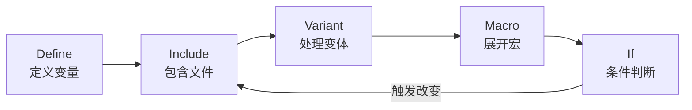

这个网页是 **ALSA 项目官方文档中关于 Use Case Manager (UCM) 配置的详细说明**。UCM 是 ALSA 库中用于管理音频设备**高级配置和状态机**的子系统，它让应用程序能够以更抽象、更一致的方式与复杂的音频硬件交互，特别是在处理**音频路由、设备切换和场景配置**时非常有用【turn0fetch0】。

下面我为你梳理其核心内容。

### 🧠 一、UCM 是什么？为什么需要它？

现代音频硬件（尤其是嵌入式设备、笔记本电脑、声卡）功能复杂，同一张声卡可能有多种使用场景（Use Case），比如：
*   **听音乐 (HiFi)**：启用扬声器或耳机，可能禁用麦克风。
*   **语音通话 (Voice Call)**：启用听筒和麦克风，可能禁用扬声器。
*   **录音 (Capture)**：启用线路输入或麦克风。

在没有 UCM 之前，应用程序需要了解并精确控制每个音频控件的开关和路由，这非常复杂且难以在不同硬件间移植。**UCM 将这些复杂逻辑封装在配置文件中**，应用程序只需请求“启用 HiFi 场景”或“启用 Voice Call 场景”，UCM 就会自动执行一系列预定义的操作（如启用/禁用特定设备、设置音量、切换路由）来完成场景切换【turn0fetch0】。

### 📁 二、UCM 配置文件结构与查找

UCM 配置文件基于 ALSA 标准配置语法，形成一个**静态配置树**。这个树在运行时根据条件和动态变量进行评估和修改，最终解析并通过 Use Case API 暴露给应用程序【turn0fetch0】。

#### 1. 配置目录与主文件查找
配置文件的查找路径由 `ucm.conf` 文件定义。其基本结构如下【turn0fetch0】：
```alsa
UseCasePath.path1 {
    Directory "conf.virt.d"
    File "${OpenName}.conf"  # OpenName 是传入的声卡名称
}
UseCasePath.path2 {
    Directory "external"
    File "${OpenName}.conf"
}
```
这表明 UCM 会在多个预定义的目录下查找与声卡名称匹配的配置文件。

#### 2. 主配置文件 (Master Sound Card File)
每个声卡都有一个主配置文件，它列出了该声卡支持的所有**动词 (Verb)**。动词代表一个高级别的使用场景【turn0fetch0】。

```alsa
# 示例主文件
Syntax 8
Comment "Nice Abstracted Soundcard"

# 定义支持的动词
SectionUseCase."Voice Call" {
    File "voice_call_blah"  # 指向该动词的详细配置文件
    Comment "Make a voice phone call."
}
SectionUseCase."HiFi" {
    File "hifi_blah"
    Comment "Play and record HiFi quality Music."
}

# 也可以使用内联配置（Syntax 8+）
SectionUseCase."Inline Example" {
    Comment "Example with inline configuration"
    Config {
        SectionVerb {
            EnableSequence [
                cset "name='Power Save' off"
            ]
            DisableSequence [
                cset "name='Power Save' on"
            ]
        }
        SectionDevice."Speaker" {
            EnableSequence [
                cset "name='Speaker Switch' on"
            ]
            DisableSequence [
                cset "name='Speaker Switch' off"
            ]
        }
    }
}

# 定义默认值
ValueDefaults {
    PlaybackChannels 4
    CaptureChannels 4
}

# 定义启动/初始化序列
BootSequence [
    cset "name='Master Playback Switch',index=2 0,0"
    cset "name='Master Playback Volume',index=2 25,25"
    msleep 50
    cset "name='Master Playback Switch',index=2 1,1"
    cset "name='Master Playback Volume',index=2 50,50"
]
FixedBootSequence [
    cset "name='Something to toggle' toggle"
]
```
*   **`SectionUseCase`**: 定义一个动词（场景）。
*   **`File`**: 指向包含该动词详细配置的文件。**Syntax 8+** 支持使用 `Config` 块进行内联定义。
*   **`ValueDefaults`**: 定义一些全局默认值，如声道数。
*   **`BootSequence`**: 在声卡初始化时执行，但**如果声卡已有 `alsactl` 保存的状态，则会被跳过**，目的是避免覆盖用户自定义的设置。
*   **`FixedBootSequence`**: **每次热插拔或启动都会强制执行**的序列，用于必须重置的设置。

#### 3. 动词配置文件 (Verb Configuration File)
动词配置文件定义了该场景下可用的**设备 (Device)**、**修饰符 (Modifier)** 以及各种**序列 (Sequence)**。它就像一个详细的“声音配置文件”【turn0fetch0】。

```alsa
# 示例动词配置文件
SectionVerb {
    # 必须的启用和禁用序列
    EnableSequence [
        disdevall ""  # 禁用所有当前设备
    ]
    DisableSequence [
        cset "name='Power Save' on"
    ]
    # 可选的转换序列
    TransitionSequence."ToCaseName" [
        disdevall ""
        msleep 1
    ]
    # 可选的值
    Value {
        TQ HiFi
        PlaybackChannels 6
    }
}

# 定义设备（一个或多个）
SectionDevice."Headphones" {
    # 支持的设备列表（互斥关系）
    SupportedDevice [
        "x"
        "y"
    ]
    # 或 ConflictingDevice ["x" "y"]
    
    EnableSequence [
        cset "name='Headphone Switch' on"
        cset "name='Headphone Playback Volume' 80"
    ]
    DisableSequence [
        cset "name='Headphone Switch' off"
    ]
    TransitionSequence."ToDevice" [
        # 切换到此设备时的序列
    ]
    Value {
        PlaybackVolume "name='Headphone Playback Volume'"
        PlaybackSwitch "name='Headphone Playback Switch'"
        PlaybackPCM "hw:${CardId},4"  # 指定使用的PCM设备
        CapturePCM "hw:${CardId},5"
    }
}

# 定义修饰符（一个或多个）
SectionModifier."Capture Voice" {
    Comment "Record voice call"
    SupportedDevice [
        "x"
        "y"
    ]
    EnableSequence [
        # 启用修饰符的序列
    ]
    DisableSequence [
        # 禁用修饰符的序列
    ]
    TransitionSequence."ToModifierName" [
        # 切换到此修饰符的序列
    ]
    Value {
        TQ Voice
        CapturePCM "hw:${CardId},11"
        PlaybackMixerElem "Master"
    }
}
```
*   **`SectionVerb`**: 定义动词本身及其全局序列。
    *   **`EnableSequence`**: **启用该场景时**执行的命令列表。通常会先调用 `disdevall ""` 来禁用当前所有设备。
    *   **`DisableSequence`**: **禁用该场景时**执行的命令列表。
    *   **`TransitionSequence`**: **从另一个场景切换到当前场景**时额外执行的序列。
*   **`SectionDevice`**: 定义一个音频端点设备，如扬声器、耳机、麦克风。
    *   **`SupportedDevice` / `ConflictingDevice`**: 声明与当前设备兼容或冲突的其他设备。用于管理设备互斥关系。
    *   **`EnableSequence` / `DisableSequence`**: 启用/禁用**该设备**时执行的命令。
    *   **`TransitionSequence`**: **从另一个设备切换到当前设备**时执行的序列。
    *   **`Value`**: 定义该设备的相关属性，如使用的PCM设备、音量/开关控件名称、优先级等。
*   **`SectionModifier`**: 定义一个对音频流进行修饰的组件，如**回声消除 (Echo Cancellation)**、**噪声抑制 (Noise Suppression)**。它通常与设备协同工作。

### ⚙️ 三、序列命令 (Sequence Commands)
在 `EnableSequence`, `DisableSequence`, `TransitionSequence`, `BootSequence` 等中，可以使用一系列命令来控制硬件和系统【turn0fetch0】。

| 命令 | 描述 | 示例 |
| :--- | :--- | :--- |
| `cset` | 设置ALSA控件的值 | `cset "name='Master Playback Volume' 50,50"` |
| `cset-new` | 创建一个新的用户自定义控件 | `cset-new "name='MyBool' type=bool,count=2 1,0"` |
| `ctl-remove` | 删除一个用户自定义控件 | `ctl-remove "name='MyBool'"` |
| `enadev` / `disdev` | 启用/禁用指定设备 | `enadev "Headphones"` |
| `disdevall` | 禁用当前动词下的所有设备 | `disdevall ""` |
| `usleep` / `msleep` | 睡眠（微秒/毫秒） | `msleep 50` |
| `exec` | 执行一个外部命令（不通过shell） | `exec "/bin/echo hello"` |
| `shell` | 通过shell执行一个命令 | `shell "amixer set Master 50%"` |
| `sysw` | 向sysfs文件系统写入数据 | `sysw "-/class/sound/ctl-led/speaker/card${CardNumber}/attach:Speaker Channel Switch"` |
| `cfg-save` | 保存库配置到文件 | `cfg-save "/tmp/test.conf:+pcm"` |

### 🏷️ 四、设备、动词命名与索引 (Naming & Indexing)
设备和动词的命名遵循一些约定，ALSA库中定义了标准名称常量（如 `SND_USE_CASE_VERB_HIFI`, `SND_USE_CASE_DEV_SPEAKER`）【turn0fetch0】。

1.  **多设备后缀**：如果存在多个同类型设备（如多个HDMI输出），应使用数字后缀，且编号必须连续（如 `HDMI1`, `HDMI2`, `HDMI3`）。名称与编号间可加空格（如 `'Line 1'` 与 `'Line1'` 等效）【turn0fetch0】。
2.  **自动设备索引分配 (Syntax 8+)**：
    *   设备名称中可包含冒号 `:` 来启用自动索引。
    *   UCM解析器会自动分配一个可用的数字索引，并移除冒号及其后的内容。
    *   例如：`SectionDevice."HDMI:primary"` 可能会被解析为 `HDMI1`，`SectionDevice."HDMI:secondary"` 解析为 `HDMI2`。
    *   这对于动态创建多个相似设备实例非常有用，无需手动管理索引号【turn0fetch0】。
3.  **设备优先级与排序 (Syntax 8+)**：
    *   设备可以根据 `Priority`, `PlaybackPriority`, 或 `CapturePriority` 的值进行**自动排序**。
    *   优先级高的设备会排在列表前面。如果优先级相同，则按设备名字母顺序排序。
    *   这让应用程序能更智能地选择默认设备【turn0fetch0】。

### 🌳 五、动态配置树与高级特性
UCM 配置文件在运行时被评估和修改，支持强大的动态特性。

#### 1. 配置树评估顺序
配置块的评估有固定顺序，当树发生改变时会重启评估【turn0fetch0】。


#### 2. 变量与替换
配置中可以使用变量并进行替换，例如 `${CardNumber}`, `${CardId}`, `${env:HOME}`, `${sys:/sys/class/sound/card0/codec_name}`【turn0fetch0】。这允许配置根据运行时环境动态调整。

#### 3. 宏 (Macros, Syntax 6+)
宏允许定义可复用的配置块，并可接受参数【turn0fetch0】。
```alsa
DefineMacro.macro1 {
    Define.a "${var:__arg1}"  # __arg1 是宏的参数
    Define.b "${var:__other}"
    # 在此可定义设备或其他块...
}
# 实例化宏
Macro.id1.macro1 {
    arg1 'something 1'
    other 'other x'
}
```

#### 4. 条件判断 (If Blocks)
使用 `If` 块可以根据条件动态包含或排除配置【turn0fetch0】。
```alsa
If.uniqueid {
    Condition {
        Type String
        Haystack "abcd"
        Needle "a"
    }
    True {
        Define.a a
    }
    False {
        Define.b b
    }
}
```
支持的**条件类型**包括：`String` (字符串比较/子串), `RegexMatch` (正则匹配), `Path` (文件存在/权限), `ControlExists` (ALSA控件存在), `AlwaysTrue` (始终真) 等。

#### 5. 变体 (Variants, Syntax 6+)
变体用于创建多个相似但略有不同的配置，避免重复【turn0fetch0】。
```alsa
# 主文件中
SectionUseCase."HiFi" {
    File "HiFi.conf"
    Variant."HiFi" { Comment "HiFi" }
    Variant."HiFi 7+1" { Comment "HiFi 7.1" }
}
# 动词文件中
SectionDevice."Speaker" {
    Value { PlaybackChannels 2 }
    Variant."HiFi 7+1".Value {
        PlaybackChannels 8  # 为"HiFi 7+1"变体覆盖此值
    }
}
```

#### 6. 设备变体 (Device Variants, Syntax 8+)
设备变体是一种更强大的机制，允许在**一个设备定义中**生成多个相关但互斥的设备变体【turn0fetch0】。
```alsa
SectionDevice."Speaker:2.0" {
    Value { PlaybackChannels 2 }
    DeviceVariant."5.1".Value {
        PlaybackChannels 6
    }
    DeviceVariant."7.1".Value {
        PlaybackChannels 8
    }
}
```
此配置会创建**三个设备**：
*   `Speaker:2.0` (基础设备，2声道)
*   `Speaker:5.1` (变体，6声道)
*   `Speaker:7.1` (变体，8声道)
这些变体设备会自动标记为**互斥**，无法同时使用。这对于同一硬件支持多种声道配置的情况非常方便。

#### 7. 启动同步 (Syntax 8+)
`BootCardGroup` 允许多张声卡协调它们的启动序列。UCM 库可以通过一个名为 `'Boot'` 的64位整数控件元素来同步初始化时机【turn0fetch0】。

### 🎯 六、最佳实践与注意事项

1.  **音量管理**：**不建议**在设备的 `Enable/DisableSequence` 中设置固定的音量值，特别是当设备导出了硬件音量控件时。默认音量应在 `BootSequence` 中设置，以便用户可以通过 `alsactl` 覆盖它们【turn0fetch0】。
2.  **设备禁用**：在动词的 `EnableSequence` 中，应确保使用 `disdevall ""` 或类似逻辑来**禁用所有当前设备**，因为前一个状态是未知的【turn0fetch0】。
3.  **互斥设备**：使用 `SupportedDevice` 或 `ConflictingDevice` 明确声明设备间的互斥关系，帮助UCM和应用正确管理设备状态。
4.  **内联与文件引用**：对于简单配置，`Syntax 8+` 的内联 `Config` 方式更简洁。对于复杂或复用的配置，引用外部文件（`File`）仍更易维护。
5.  **利用高级特性**：**自动索引**、**设备变体**和**优先级排序**等特性可以大大简化复杂硬件的配置，建议善加利用。

### 💎 总结

ALSA UCM 是一个强大且灵活的音频配置管理框架。通过它，硬件厂商和系统开发者可以：

*   **抽象复杂性**：将底层的音频路由、控件操作封装成高级场景。
*   **提升兼容性**：应用程序通过标准API调用场景，无需关心底层硬件差异，更易在不同设备上运行。
*   **实现智能切换**：利用设备优先级、互斥关系和转换序列，实现流畅的音频场景切换。
*   **动态适应环境**：通过变量、条件、宏和变体，创建能适应不同运行时环境的配置。

这份官方文档（[ALSA Use Case Configuration](https://www.alsa-project.org/alsa-doc/alsa-lib/group__ucm__conf.html)）是深入理解和使用 UCM 的权威参考。如果你需要为特定的音频硬件编写或理解 UCM 配置，这将是你的核心指南。