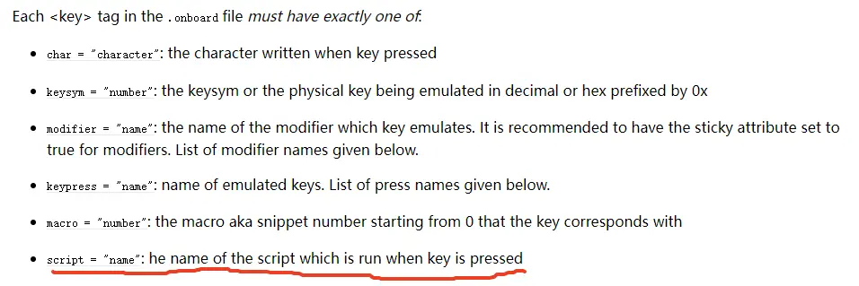

xinput2 

## xserver

> xserver是如何处理键盘输入的？从一个物理按键按下到终端上显示一个字符的流程是怎样的？


X server 处理键盘输入的流程涉及多个步骤，从物理键盘输入到在终端应用程序中显示字符。以下是这一过程的大致流程：

1. **按键扫描**：
   - 物理按键按下时，键盘控制器生成一个“扫描码(scancode)”。
   - 扫描码是硬件特定的，代表了具体的按键事件（按下或释放）。

2. **内核输入事件**：
   - 操作系统的内核接收扫描码，并将其转换为“键码(keycode)”。
   - Linux 上，内核输入子系统管理此转换，并通过 `/dev/input/event*` 设备文件暴露给用户空间。

3. **X server 处理**：
   - X server 通过输入驱动程序（常见的如 `evdev` 或 `libinput`）捕获键码。
   - 然后，X server 使用 X Keyboard Extension (XKB) 将键码转换为 keysym（键符号），这就是一个可以由应用程序识别的符号。

4. **键符号映射**：
   - XKB 使用配置文件来定义如何将键码映射到键符号。这些配置文件允许复杂的键盘布局、修饰键（例如 Shift, Ctrl）的处理。
   - 用户可以通过 `setxkbmap` 或配置文件自定义键映射。

5. **事件传递**：
   - X server 将产生的键符合成一个键盘事件，并将其发送到当前具有焦点的 X 客户端（即应用程序）。
   - 如果键盘事件对应一个字符输入（如字母数字按键），X client 接收到事件后，会处理并显示相应字符。

6. **终端处理**：
   - 在终端应用程序中（如 GNOME Terminal, Konsole），字符输入被接收并插入到终端的缓冲区。
   - 终端处理这些字符并将其显示在屏幕上。
   - 对于某些修饰符，比如 Ctrl+C，终端会识别特殊的控制序列并执行相应操作（如中断）。

上述流程中，键盘输入从物理按键到操作系统再到 X server 进行了多次转换，以确保可以处理不同语言、布局以及支持多种修饰符组合。


## 输入法及键盘

### onboard

- 自定义局部及功能

[lomky/zhuyin-onboard-layout](https://github.com/lomky/zhuyin-onboard-layout)



通过指定script可以自定义按键的任意功能

```html
<key button="true" id="gedit" label="Gedit" scan_priority="1" script='gedit' />
```


> 键盘改键及屏蔽？使用xmodmap这个工具

xmodmap -pke

xmodmap -e "keycode 37 = Control_L" -e "keycode 105 = Control_R" -e "keycode 105 = Control_L" -e "keycode 37 = Control_R"