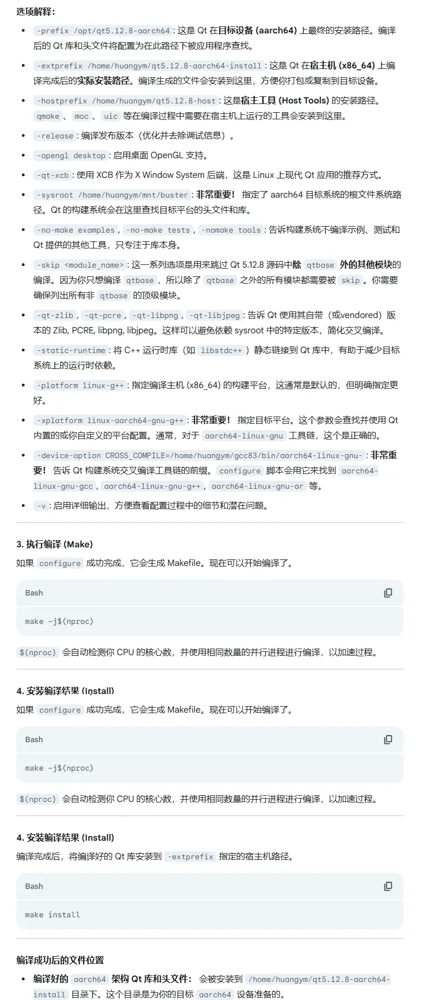

### 方式一

构建一个低版本交叉编译器，然后使用交叉编译器编译其他库。该方式的优点在于可控，并且编译器的版本越低可以适配的系统就越多。避免了重复适配。但是缺点就是该方式较为复杂。


### 方式二

采用qemu和根文件系统的方式进行快速适配。适用于提供了文件系统镜像的情况下。

1. 挂载镜像
2. chroot进入镜像安装编译环境

```bash

sudo apt install qemu-user-static

update-binfmts --display

echo ':aarch64:M::\x7fELF\x02\x01\x01\x00\x00\x00\x00\x00\x00\x00\x00\x00\x02\x00\xb7\x00:\xff\xff\xff\xff\xff\xff\xff\x00\xff\xff\xff\xff\xff\xff\xff\xff\xfe\xff\xff\xff:/usr/bin/qemu-aarch64-static:' | sudo tee /proc/sys/fs/binfmt_misc/register


sudo mount --bind /dev /mnt/uos/dev
sudo mount --bind /dev/pts /mnt/uos/dev/pts
sudo mount --bind /proc /mnt/uos/proc
sudo mount --bind /sys /mnt/uos/sys

sudo chroot /mnt/uos

sudo umount /mnt/uos/sys
sudo umount /mnt/uos/proc
sudo umount /mnt/uos/dev/pts
sudo umount /mnt/uos/dev

```


**镜像扩容**

```bash
resize2fs 0925_RK_test_rootfs.img 6G
```


### libpython3.8-dev

```
./configure 
```


[使用debootstrap构建制作aarch64/arm64 Debian rootfs文件系统-阿里云开发者社区](https://developer.aliyun.com/article/1172718)

```
# 设置 locales（语言环境）
apt install locales dialog 
dpkg-reconfigure locales
```


