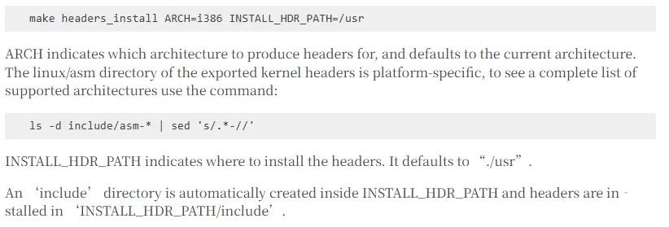

### 方式一

> 交叉编译器 + 源码

优点：
- 精准的版本控制
- 适配范围广，无需重复工作

缺点：
- 复杂，需要解决各种编译问题
- 依赖过多的情况下工作量大

对于像qt这样构建依赖很多的库不是很方便。对于这些构建依赖，最好的办法是能有一个目标架构的根文件系统


**GCC交叉编译器构建流程** ^68b560

构建的整体流程如下：

1. 构建合适版本的glibc库（glibc+kernel_header)
2. 构建gcc（gcc + 4个deps + binutils)

[构建glibc并安装到指定目录 - glibc wiki](https://sourceware.org/glibc/wiki/Testing/Builds#Building_glibc_with_intent_to_install)
[使用安装到指定目录中的glibc - glibc wiki](https://sourceware.org/glibc/wiki/Testing/Builds#Compile_against_glibc_in_an_installed_location)

```bash
#!/bin/bash
# 使用交叉编译器构建arm64版本的glibc

export LD_LIBRARY_PATH=

CC=aarch64-linux-gnu-gcc-8
CXX=aarch64-linux-gnu-g++-8

../../glibc-2.28/configure --prefix=/usr --host=aarch64-linux-gnu --disable-werror

# 这里的prefix不是最后安装的那个真是的/usr路径。而是安装时指定的DESTDIR+prefix才是最总的glibc安装路径。DESTDIR相当于虚根
```

glibc安装后还需要安装内核头文件，这样才是完整的glibc头文件。导出内核头文件的指令是


[Installing GCC - GNU Project](https://gcc.gnu.org/install/)

```bash
#!/bin/bash
# 构建arm64交叉编译器
../../gcc-8.3.0/configure -v --enable-languages=c,c++ --prefix=/usr --program-suffix=-83 --enable-shared --enable-linker-build-id --without-included-gettext --enable-threads=posix  --enable-multiarch --enable-fix-cortex-a53-843419 --disable-werror --enable-checking=release --build=x86_64-linux-gnu --host=x86_64-linux-gnu --target=aarch64-linux-gnu --program-prefix=aarch64-linux-gnu- --with-sysroot=/home/huangym/gnu/out/
```

其中4个deps指的是gcc构建依赖的外部库(gmp,mpfr,mpc,isl)。这些库的版本和下载地址可以通过gcc源码目录下的 `contrib/download_prerequisites` 脚本文件中获取到。除了 `isl` 这个库，其他3个库以及gcc的源码均可以在 [中科大开源镜像站中找到](https://mirrors.ustc.edu.cn/gnu) 。

binutils的版本是无所谓的，可以用最新的版本。

### 方式二

> 交叉编译器 + 目标架构根文件系统(方便包管理工具安装构建依赖) + 源码

采用qemu和根文件系统的方式进行快速适配。适用于提供了文件系统镜像的情况下。

1. 挂载镜像
2. chroot进入镜像安装编译环境

可以参考：[4. 交叉编译Qt库(Qt5) — [野火]嵌入式Qt应用开发实战指南—基于LubanCat-RK开发板 文档](https://doc.embedfire.com/linux/rk356x/Qt/zh/latest/lubancat_qt/install/install_arm_2.html)


```bash

sudo apt install qemu-user-static

update-binfmts --display

echo ':aarch64:M::\x7fELF\x02\x01\x01\x00\x00\x00\x00\x00\x00\x00\x00\x00\x02\x00\xb7\x00:\xff\xff\xff\xff\xff\xff\xff\x00\xff\xff\xff\xff\xff\xff\xff\xff\xfe\xff\xff\xff:/usr/bin/qemu-aarch64-static:' | sudo tee /proc/sys/fs/binfmt_misc/register


sudo mount --bind /dev /mnt/uos/dev
sudo mount --bind /dev/pts /mnt/uos/dev/pts
sudo mount --bind /proc /mnt/uos/proc
sudo mount --bind /sys /mnt/uos/sys

sudo chroot /mnt/uos

sudo umount /mnt/uos/sys
sudo umount /mnt/uos/proc
sudo umount /mnt/uos/dev/pts
sudo umount /mnt/uos/dev


# 镜像空间扩容，解决apt安装空间不足问题

resize2fs 0925_RK_test_rootfs.img 6G

# 设置 locales（语言环境）
apt install locales dialog 
dpkg-reconfigure locales

```


### 方式三

> 目标架构根文件系统(提供：编译器+依赖) + 源码

缺点：
- 指令转译导致构建速度慢
- 目标根文件系统不一定容易获取到


## Qt编译


**方式3** 的编译配置命令（直接编译）

```bash
rm config.cache
../qt-everywhere-src-5.12.8/configure -release -opensource -confirm-license 
-qt-xcb 
-nomake examples 
-nomake tests 
-nomake tools 
-skip qtwebengine 
-skip qtimageformats 
-skip qtdeclarative 
-skip qtgraphicaleffects 
-skip qtlocation 
-skip qtsensors 
-skip qtwayland 
-skip qtwebchannel 
-skip qtwebsockets 
-skip qtgamepad 
-skip qtquickcontrols 
-skip qtquickcontrols2 
-skip qtscxml 
-skip qtcharts 
-skip qtdatavis3d 
-skip qtvirtualkeyboard 
-skip qtserialbus 
-skip qtremoteobjects 
-skip qttools 
-skip qt3d 
-skip qtconnectivity 
-skip qtpurchasing 
-qt-zlib -qt-pcre -qt-libpng -qt-libjpeg 
-prefix /opt/qt5 
-recheck-all 
-v
```

`-skip xxx` : 跳过模块，模块名称对应qt源码根目录下的模块一级目录名称
`-qt-xxx` : 使用qt源码内置的三方库，不依赖系统的
`-v` : 详细输出，方便查看配置过程的问题


**方式1，2** 编译配置指令（交叉编译）

**Qt交叉编译构建流程：**

1. 准备好交叉编译器 [here](#^68b560)
2. 一个安装好构建Qt源码所需的所有依赖库的目标系统的根文件系统。使用rsync来同步依赖的增加
```bash
rsync -ar buster/lib/ sysroot/lib/
rsync -ar buster/usr/include/ sysroot/usr/include/
rsync -ar buster/usr/lib/ sysroot/usr/lib/

# buster是通过debootstrap生成的根文件系统

# 修复libpthrad, libm, libdl的软链接
cd sysroot/lib/aarch64-linux-gnu
ln -sf libpthread.so.0 libpthread.so
ln -sf libm.so.6 libm.so
ln -sf libdl.so.2 libdl.so
```

3. 添加自定义的mkspec配置文件。qt源码的目录下(qtbase/mkspec或者qtbase/mkspec/device)创建自定义配置
```bash
$ cp -r qtbase/mkspecs/linux-aarch64-gnu-g++ uos-arm64-g++
$ cat ../qtbase/mkspecs/uos-arm64-g++/qmake.conf
#
# qmake configuration for building with aarch64-linux-gnu-g++
#

MAKEFILE_GENERATOR      = UNIX
CONFIG                 += incremental
QMAKE_INCREMENTAL_STYLE = sublib

include(../common/linux.conf)
include(../common/gcc-base-unix.conf)
include(../common/g++-unix.conf)

BIN = /home/huangym/mnt/out/usr/bin/aarch64-linux-gnu

# modifications to g++.conf
QMAKE_CC                = $$BIN-gcc-83
QMAKE_CXX               = $$BIN-g++-83
QMAKE_LINK              = $$BIN-g++-83
QMAKE_LINK_SHLIB        = $$BIN-g++-83

# modifications to linux.conf
QMAKE_AR                = $$BIN-ar-83 cqs
QMAKE_OBJCOPY           = $$BIN-objcopy-83
QMAKE_NM                = $$BIN-nm-83 -P
QMAKE_STRIP             = $$BIN-strip-83

QMAKE_RPATHLINKDIR_POST += $$[QT_SYSROOT]/usr/lib $$[QT_SYSROOT]/usr/lib/aarch64-linux-gnu $$[QT_SYSROOT]/lib/aarch64-linux-gnu

load(qt_config)
```

4. configure

```bash
#!/bin/bash

rm config.cache

ROOTFS=/home/huangym/mnt/sysroot
export PKG_CONFIG_SYSROOT_DIR=$ROOTFS
export PKG_CONFIG_LIBDIR=$ROOTFS/usr/lib/pkgconfig:$ROOTFS/usr/share/pkgconfig:$ROOTFS/usr/lib/aarch64-linux-gnu/pkgconfig
DEVICE=
CROSS_CHAIN_PREFIX=/home/huangym/mnt/out/usr/bin

../configure -release -opensource -confirm-license \
-qt-xcb \
-no-opengl \
-nomake examples \
-nomake tests \
-nomake tools \
-skip qtwebengine \
-skip qtimageformats \
-skip qtdeclarative \
-skip qtgraphicaleffects \
-skip qtlocation \
-skip qtsensors \
-skip qtwayland \
-skip qtwebchannel \
-skip qtwebsockets \
-skip qtgamepad \
-skip qtquickcontrols \
-skip qtquickcontrols2 \
-skip qtscxml \
-skip qtcharts \
-skip qtdatavis3d \
-skip qtvirtualkeyboard \
-skip qtserialbus \
-skip qtremoteobjects \
-skip qttools \
-skip qt3d \
-skip qtconnectivity \
-skip qtpurchasing \
-qt-zlib -qt-pcre -qt-libpng -qt-libjpeg \
-prefix /qt5 \
-v \
-sysroot ${ROOTFS} \
-xplatform uos-arm64-g++
```

`-platform` : 编译平台架构配置
`-xplatform` : 交叉编译需要指定的目标平台选项
`-device` : 特定设备或芯片集。这个更多面向嵌入式设备，不是常规Linux
`-device-option` : 

5. make 和 install

交叉编译后qt的安装的目录在 `sysroot/prefix` 

**编译问题解决**

- 未生成需要的qt模块
- 生成的qt模块但是功能有缺失（如无法显示字体）


```
# 上述问题一般都是缺少编译依赖导致的，通过分析 
config.log / config.summary 
来排查依赖缺失导致的编译问题
```


**单独编译qt某个模块** 

当明确知道缺少哪个模块的时候，重复执行配置等操作很耗时。可以指定单独编译某个模块

```
make -j4 module-qtserialport
```

模块名称就是qt源码根目录下的目录名称，前面再加上module即可


#### 参考


[使用debootstrap构建制作aarch64/arm64 Debian rootfs文件系统-阿里云开发者社区](https://developer.aliyun.com/article/1172718)
[Building Qt 5 from Git - Qt Wiki](https://wiki.qt.io/Building_Qt_5_from_Git#Getting_the_source_code)
[Qt Configure Options | Qt 5.15](https://qthub.com/static/doc/qt5/qtdoc/configure-options.html)
[Exporting kernel headers for use by userspace — The Linux Kernel documentation](https://www.kernel.org/doc/html/latest/kbuild/headers_install.html)
