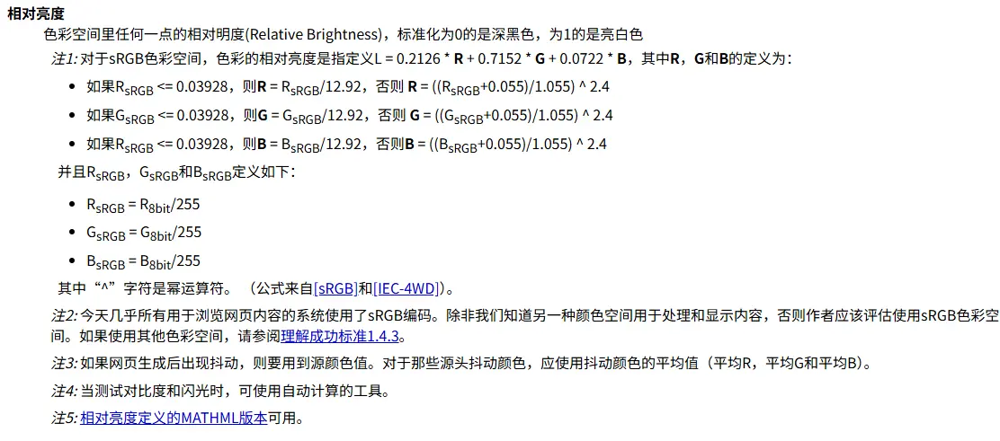

## 引

- web 内容无障碍指南(WCAG)
- W3C 的web无障碍倡议（WAI）发布的一系列有关web无障碍指南的一部分

### 对比度算法

- WCAG 2.0：Web Content Accessibility Guideline
- APCA：


[APCA算法](https://www.cnblogs.com/EnSnail/p/14532028.html)


## WCAG 2算法

计算前景色和背景色的亮度比值。

https://www.w3.org/Translations/WCAG20-zh/




```python
# 1. sRGB颜色空间转换为线性颜色空间
RGB=[R,G,B]
for C in RGB:
	if C/255 <= 0.03928:
		C = C/255/12.92
	else
		C = ((C/255+0.055)/1.055)^2.4
		
		
# 2. 颜色的相对亮度
L = 0.2126 * R + 0.7152 * G + 0.0722 * B

wcag = L_fg / L_bg
```