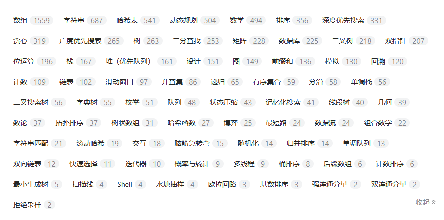

### 学习资料

[javascript-algorithms/README.zh-CN.md at master · trekhleb/javascript-algorithms (github.com)](https://github.com/trekhleb/javascript-algorithms/blob/master/README.zh-CN.md)

[labuladong/fucking-algorithm: 刷算法全靠套路，认准 labuladong 就够了！English version supported! Crack LeetCode, not only how, but also why. (github.com)](https://github.com/labuladong/fucking-algorithm)、

《算法导论》

### 内容整理

> 内容整理的目的：
> 1. 建立算法相关内容的体系结构
> 

[哈希表](哈希表.md) 

